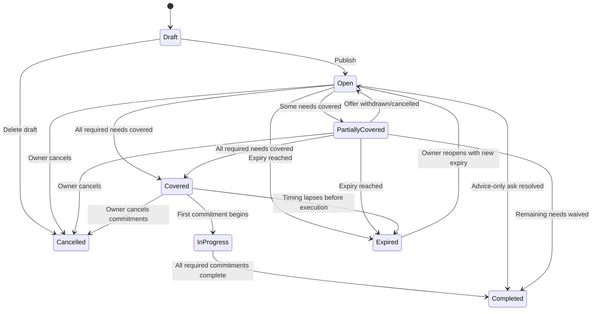
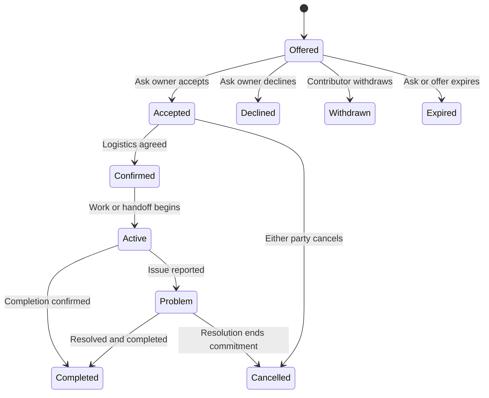
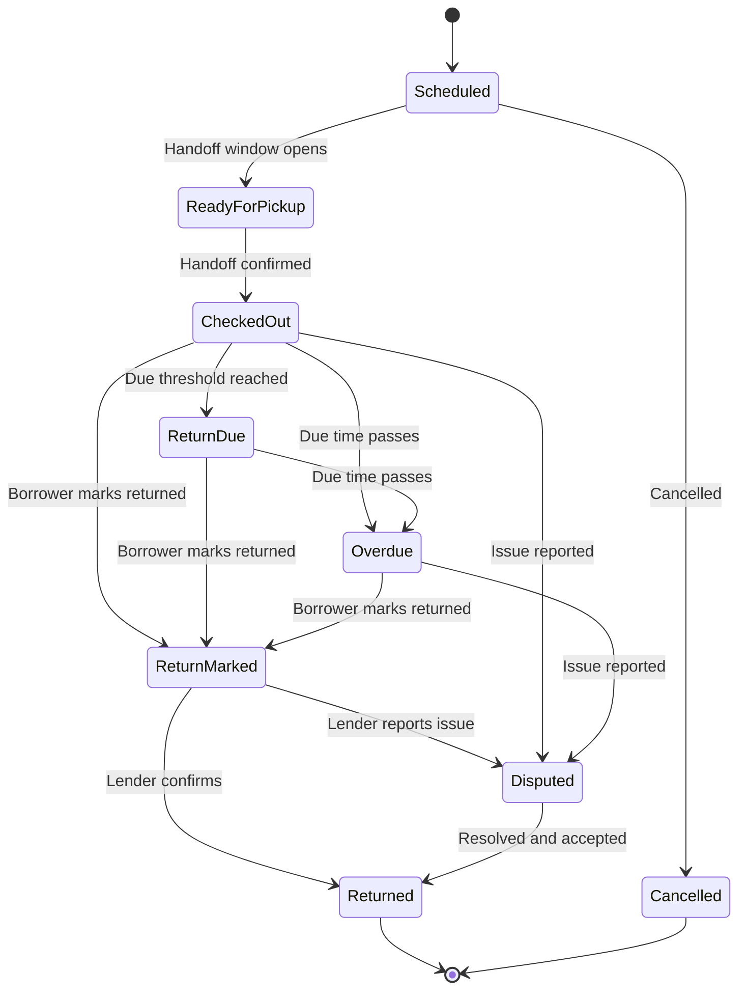
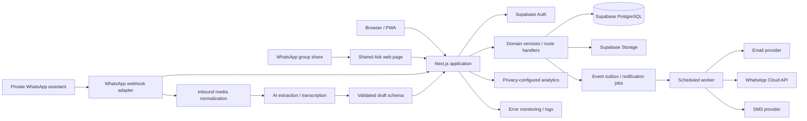

> **Production Handoff v2 override (updated 2026-07-29):** This original PRD is preserved for complete product rationale. When it conflicts with `AGENTS.md`, `docs/00_EXECUTIVE_DECISIONS.md`, or another numbered v2 specialization document, the v2 document wins. The selected deployment platform is Netlify (ADR-016), the Paseos pilot rules are in `docs/25_PASEOS_PILOT_MEMBERSHIP_ADMIN_AND_LAUNCH.md`, and the canonical UI is `visuals/00_CANONICAL_UI_DIRECTION.png`.

# Call On — Product Requirements Document

> **Working title only.** The product name is not decided and should not constrain the product architecture.

| Field | Value |
|---|---|
| Document | Product Requirements Document |
| Version | 0.1 |
| Status | Implementation-grade draft for critique and pilot planning |
| Date | July 24, 2026 |
| Product owner | Bruce Pinchbeck |
| Initial pilot | One private HOA/neighborhood circle currently organized through WhatsApp |
| Primary audience | Product, design, engineering, trust and safety, legal counsel, pilot operators, AI coding agents |

---

## 1. Executive summary

Call On is a **private, request-first coordination network for real-world community sharing**. It helps someone turn a normal group-chat message such as “Does anyone have two folding tables for Saturday?” into a structured Ask that neighbors can fulfill with items, time, skills, advice, or alternatives. The system tracks what was promised, who is coordinating with whom, when an item changes hands, and whether it was returned.

The product is explicitly **not** a static inventory catalog, public social network, rental marketplace, or HOA surveillance tool.

The central product insight is:

> **The user should not have to build an inventory before receiving value. Inventory should emerge gradually from actual acts of helping.**

The second core insight is:

> **The app should be callable from spaces where a community already communicates, rather than requiring the community to relocate into another feed.**

For the initial HOA pilot, WhatsApp remains the attention and conversation layer. Call On provides the missing structure, memory, privacy controls, matching, handoff tracking, and completion loop.

### 1.1 One-sentence product definition

**Call On turns “Does anybody have…?” into a private, trackable plan among trusted people nearby.**

### 1.2 Core product loop

```text
A real need occurs
    ↓
Someone creates an Ask in less than one minute
    ↓
The Ask is shared into an existing group chat
    ↓
Neighbors offer an item, help, knowledge, or an alternative
    ↓
The requester accepts one or more offers
    ↓
The system coordinates the commitment, handoff, and return
    ↓
The Ask closes with a thank-you and optional completion update
    ↓
Useful inventory and trust history accumulate as a byproduct
```

### 1.3 Final decisions embodied in this PRD

| Decision | Product consequence |
|---|---|
| The primary object is an **Ask**, not an item listing | The product begins with immediate demand and avoids an empty-library cold start |
| A Project or Event is an Ask with multiple needs | Simple borrowing remains lightweight while richer coordination is possible |
| WhatsApp is a distribution surface, not the system of record | Every Ask has a canonical web record and link |
| MVP uses share-to-WhatsApp, not automatic group ingestion | Launch is not blocked by WhatsApp group API limitations or admin access |
| A private one-to-one WhatsApp assistant is a subsequent release | Users can later text, forward, photograph, or voice-note a request to the assistant |
| Persistent inventory is optional | A neighbor can offer an unlisted item without creating a listing first |
| Resource “hints” precede detailed listings | Members can say they are comfortable being asked about broad categories |
| Declining is private and consequence-free | The system reduces social pressure on generous members |
| Peer-owned items require owner confirmation | Personal items are requested, not automatically booked |
| Circle-owned assets may eventually be directly reservable | HOA or club equipment can use a calendar in a later release |
| No public star ratings or opaque trust score | Reliability is represented through factual transaction history and unresolved issues |
| No payments, deposits, ads, or transaction fees in the pilot | The cooperative behavior can be tested without commercial complexity |
| No infinite social feed | The home surface prioritizes obligations, active needs, and completed projects |
| AI drafts and structures; people confirm | AI never publishes, certifies safety, assigns trust, or resolves disputes autonomously |

---

## 2. Product thesis

Most local communities already have communication infrastructure: WhatsApp groups, text threads, Facebook groups, Slack workspaces, email lists, or informal conversations. Those systems are effective at getting attention but weak at converting an informal request into a reliable, private, accountable plan.

A typical message creates several problems:

- Offers get buried in conversation.
- Multiple people offer the same thing while another need remains uncovered.
- Nobody knows whether the requester accepted an offer.
- Pickup details expose personal information to the whole group.
- Return dates are forgotten.
- The community never remembers that an item may be available in the future.
- Helpful members receive repeated public pressure to participate.
- Successful cooperation creates no durable infrastructure for the next request.

A traditional tool-library application solves the memory problem but introduces a larger activation problem: it asks people to list possessions in advance, set detailed availability, maintain stale records, and revisit a low-frequency destination app.

Call On combines the strengths of both models:

```text
Existing chats provide attention and social context.
Call On provides structure and memory.
```

The product should be judged primarily by **completed neighbor assists**, not daily active use. A household may use the product only when preparing a party, repairing a fence, cleaning a patio, organizing a community event, or avoiding a one-time purchase. Low individual frequency is acceptable if a sufficiently dense circle reliably responds when activated.

---

## 3. Problem statement

### 3.1 User problem

People often need an item, a small amount of practical knowledge, or a short period of help that already exists nearby. They frequently buy, abandon, or improvise because asking is socially awkward and coordinating through chat is unreliable.

### 3.2 Community problem

Private groups have latent supply but no usable map of it. The community does not know:

- What categories members may be comfortable sharing.
- Who is willing to help at this moment.
- Which needs are already covered.
- Which items are currently out on loan.
- Whether commitments were completed.
- How to preserve trust without turning generosity into a public score.

### 3.3 Product problem

A new application faces two cold starts:

1. **Supply cold start:** few members have listed items.
2. **Attention cold start:** members continue using the chat they already open every day.

The product must therefore create value from a single Ask, work before a full inventory exists, and travel through existing communication channels.

### 3.4 Why current alternatives are insufficient

| Alternative | Strength | Structural weakness for this use case |
|---|---|---|
| WhatsApp or text group | Existing attention and trust | No structured needs, fulfillment state, custody log, or durable matching memory |
| Nextdoor/Facebook group | Broad reach | Noise, gossip, weak privacy, strangers, engagement incentives, poor transaction tracking |
| Buy Nothing group | Strong sharing culture | Primarily post/feed based; coordination and loan custody remain conversational |
| Rental marketplace | Clear inventory and terms | Commercial relationship, fees, deposits, public marketplace behavior, higher liability expectations |
| Formal tool library | Reliable institutional inventory | Requires physical operations, hours, storage, maintenance, and funding |
| Spreadsheet | Flexible and cheap | High maintenance burden, poor mobile experience, stale data, no workflow automation |

---

## 4. Vision and desired outcome

Call On should make a community feel more like the idealized neighborhood where people know who has a ladder, who understands irrigation, who can help move a table, and who is happy to be asked—without requiring everyone to already know one another.

The product succeeds when it produces all three outcomes:

1. **Practical:** a need gets resolved without unnecessary purchasing.
2. **Relational:** neighbors meet or interact through a useful, bounded reason.
3. **Institutional:** the community becomes better able to coordinate the next time.

### 4.1 Experience promise

For a requester:

> “I can explain what I am doing in normal language, share one useful link, and quickly see what is covered.”

For a contributor:

> “I can help in a few taps without downloading an app or exposing my possessions to everyone.”

For a lender:

> “I remain in control of whether, when, and how I lend an item, and the system quietly helps me get it back.”

For a community organizer:

> “The group produces more useful cooperation without becoming another noisy social network.”

---

## 5. Goals and non-goals

### 5.1 Product goals

1. Allow a verified member to create and publish a useful Ask in **under 60 seconds**.
2. Allow a first-time recipient of a shared Ask to offer help in **under 30 seconds before identity verification** and without installing an application.
3. Allow one Ask to contain an item need, advice need, volunteer slot, material need, or several of these together.
4. Prevent duplicate fulfillment by showing quantities covered and outstanding.
5. Convert accepted offers into explicit, private commitments.
6. Track item handoff, due date, return, extensions, and issues with risk-proportionate friction.
7. Let persistent inventory grow from completed transactions rather than mandatory setup.
8. Protect exact addresses, contact information, detailed schedules, and high-value inventory.
9. Make declining or ignoring a match private and socially safe.
10. Create a natural completion and gratitude moment that can be shared back into the original group.
11. Enable a circle to activate and remain useful without requiring frequent destination-app engagement.
12. Establish an architecture that can support WhatsApp, web, email, SMS, Slack, or other channel adapters without making any one platform the source of truth.

### 5.2 Business and learning goals

1. Determine whether a private circle can generate repeatable liquidity around real needs.
2. Determine whether shared Asks recruit new participants more effectively than generic invitations.
3. Determine whether members will save an item or willingness category after a successful interaction.
4. Determine whether completed assists create measurable social connection.
5. Determine whether the product is more trusted when member-led, HOA-sponsored, or quietly supported by both.
6. Identify the smallest set of safety controls necessary to support casual peer lending without making every transaction feel contractual.
7. Preserve a future path to paid circle administration without monetizing individual generosity.

### 5.3 Non-goals for the pilot

The pilot will not attempt to become:

- A public neighborhood social network.
- A replacement for WhatsApp discussion, group events, polls, or announcements.
- A marketplace for paid rentals or professional services.
- A lead-generation directory for contractors.
- A homeowner-association enforcement or surveillance tool.
- A social-credit or gamification system.
- An insurance or damage-guarantee product.
- A native iOS or Android application.
- A delivery or logistics service.
- A child-care, ride-sharing, medical, legal, or emergency-response service.
- A platform for hazardous, regulated, recalled, illegal, or professional-grade equipment.
- A comprehensive household inventory manager.

---

## 6. Success metrics

### 6.1 North-star metric

**Completed neighbor assists per activated circle per month**

A **neighbor assist** is a commitment that reaches a valid completion state:

- A borrowed item is returned and confirmed.
- A donated item or material is handed over and confirmed.
- A volunteer task is marked complete by the requester.
- Advice is marked useful/resolved by the requester.
- A requested alternative is accepted and resolves the need.

An **activated circle** is a circle that, within a rolling 21-day period, has:

- At least 5 verified members representing at least 4 households or units.
- At least 3 published Asks.
- At least 3 completed neighbor assists.
- At least 3 distinct contributors.

This definition prevents profile creation or item-list counts from being mistaken for activation.

### 6.2 Primary product metrics

| Metric | Definition | Why it matters |
|---|---|---|
| Ask publication rate | Published Asks / Ask drafts started | Measures composer friction |
| Time to first qualified offer | Time from publication to first non-spam offer relevant to a need | Measures perceived liquidity |
| Offer coverage rate | Asks receiving at least one relevant offer / published Asks | Measures whether the circle wakes up |
| Full resolution rate | Asks completed with all required needs resolved / eligible Asks | Measures actual utility |
| Commitment completion rate | Completed commitments / accepted commitments | Measures follow-through |
| On-time return rate | Loans returned by due time or approved extension / completed loans | Measures operational trust |
| Unique contributor rate | Distinct contributors / active circle members | Measures concentration versus broad participation |
| First-link contribution conversion | First-time Ask visitors who submit an offer / first-time Ask visitors | Measures viral onboarding effectiveness |
| Resource-save conversion | Completed physical-item offers saved as reusable resources or hints / eligible completed offers | Measures organic inventory growth |
| Repeat participation | Members who create or contribute again within 30 days / first-time participants | Measures remembered value |
| Cross-circle creation | Existing participants who later start another circle | Measures community-by-community expansion |
| New-neighbor connection rate | Completed interactions where a participant reports meeting or speaking with someone new | Measures the social outcome |

### 6.3 Guardrail metrics

| Guardrail | Definition |
|---|---|
| Incident rate | Reported incidents per 100 completed commitments |
| Serious safety incident rate | Injury, credible threat, prohibited item, or legal escalation per 1,000 commitments |
| Unresolved overdue rate | Active loans overdue by more than 7 days / active loans |
| Unwanted matching rate | “Stop asking me,” block, or notification complaint actions / proactive match notifications |
| Spam rate | Offers or messages removed as solicitation, fraud, or abuse / total offers and messages |
| Admin intervention rate | Commitments requiring moderator action / total commitments |
| Link leakage rate | Ask links accessed or acted upon by rejected non-members / published Asks |
| Member concentration | Percentage of completed assists supplied by the top 10% of contributors |
| Quiet-mode adoption | Members enabling temporary or permanent matching pauses |

### 6.4 Initial pilot targets

These are test thresholds, not guaranteed performance commitments:

- At least 10 authentic Asks published during the first 30 days.
- At least 70% of Asks receive one relevant offer within 24 hours.
- At least 50% of eligible Asks are fully resolved by their deadline.
- Median time to first qualified offer below 6 hours.
- At least 85% of accepted commitments reach completion.
- At least 90% of completed physical loans close without a reported issue.
- At least 25% of first-time contributors participate again within 30 days.
- At least 20% of eligible completed item offers create a reusable resource or private resource hint.
- No serious safety incident.
- Less than 5% of members report unwanted contact, confusing privacy, or excessive notifications.

---

## 7. Users, roles, and jobs to be done

### 7.1 Requester

A person trying to complete a bounded real-world task.

**Jobs:**

- “When I am about to buy or improvise around something I need briefly, help me ask nearby people without feeling awkward.”
- “When I am organizing an event or project, show everyone what is covered and what remains.”
- “When several people offer help, help me choose and coordinate without cluttering the group chat.”

### 7.2 Contributor

A person willing to lend, give, advise, volunteer, or suggest an alternative.

**Jobs:**

- “When I see a concrete need I can address, let me help immediately without creating a full profile.”
- “Let me offer something I have not previously listed.”
- “Let me say no or ignore a match without publicly rejecting a neighbor.”

### 7.3 Lender

A contributor whose physical item changes custody.

**Jobs:**

- “Let me remain in control of the item, timing, included pieces, and pickup method.”
- “Help me receive the item back without having to nag.”
- “Create a private record if the item is late, incomplete, or damaged.”

### 7.4 Organizer

A requester coordinating a multi-need project or event.

**Jobs:**

- “Let multiple people claim distinct needs without duplication.”
- “Give me a live checklist I can share back into the chat.”
- “Help me thank contributors and close the project cleanly.”

### 7.5 Circle champion

The person who starts or energizes the private circle. The champion may or may not be an HOA official or WhatsApp administrator.

**Jobs:**

- “Help me launch this around real value rather than asking everyone to complete setup.”
- “Give me lightweight moderation and membership controls.”
- “Show whether the circle is functioning without exposing private transaction details.”

### 7.6 Moderator or circle administrator

A trusted person responsible for membership, prohibited content, and escalated incidents.

**Jobs:**

- “Let me approve members and remove obvious bad actors.”
- “Let me investigate only the data necessary for an escalated incident.”
- “Do not make me responsible for every late return or private coordination message.”

### 7.7 Nontechnical occasional member

A member who primarily uses WhatsApp, rarely installs new apps, and may interact only a few times per year.

**Jobs:**

- “Show me one clear action at a time.”
- “Do not require a password, profile completion, or inventory setup.”
- “Let me use ordinary language, photographs, and voice.”

---

## 8. Product principles

1. **Start with the need, not the profile.** The first meaningful experience is creating or answering an Ask.
2. **Participation is onboarding.** Identity and preferences are collected only when necessary to complete an action.
3. **Inventory is learned progressively.** A category hint can become an actual item after a real transaction.
4. **The app is callable, not visitable.** A user should receive value from a shared link or channel interaction without browsing a destination feed.
5. **Existing chats retain their social role.** Call On does not compete with general conversation.
6. **Every post must be actionable and expiring.** The product does not permit general-purpose status posts.
7. **Private refusal is a core feature.** Silence and “not this time” carry no public penalty.
8. **Personal items are requested, not presumed available.** Availability is never a permanent promise.
9. **Friction scales with risk.** A cooler and a pressure washer do not use the same handoff flow.
10. **Trust is factual, not performative.** No stars, generosity ranks, or opaque score.
11. **Completion is more important than engagement.** The system celebrates resolved needs, not comments or reactions.
12. **AI proposes; users decide.** All extracted or inferred facts require confirmation.
13. **Privacy is the default configuration.** Exact location and detailed inventory are revealed only when needed.
14. **Administration is scoped and auditable.** Circle admins do not automatically gain access to private messages.
15. **No business model should tax generosity.** Future monetization should attach to circle administration or shared assets, not a neighbor-to-neighbor transaction fee.

---

## 9. Product vocabulary and domain model

The product should use a small, understandable user-facing vocabulary. Engineering may use more precise internal terms.

| User-facing term | Internal object | Definition |
|---|---|---|
| Circle | `circle` | A private trusted group such as an HOA, block, school-parent group, church, or club |
| Ask | `ask` | A bounded request or offer with an owner, audience, timing, and completion state |
| Need | `ask_need` | One specific item, action, skill, material, or advice requirement within an Ask |
| Offer | `offer` | A member’s proposed contribution to one Need |
| Plan | `commitment` | An accepted Offer with concrete expectations and logistics |
| Borrowed item | `loan` | A physical-item commitment with custody, due date, return, and issue state |
| Something I may have | `resource_hint` | A private category-level willingness signal used for matching |
| Saved item | `resource` | A confirmed reusable item or capability with owner-controlled visibility |
| Issue | `incident` | A private report concerning safety, damage, non-return, harassment, spam, or policy violation |

### 9.1 Relationship model

```text
User ──< Membership >── Circle

Circle ──< Ask ──< Need ──< Offer ──0..1 Commitment ──0..1 Loan

User ──< ResourceHint
User ──< Resource ──< ResourceComponent

Ask / Commitment / Loan ──< Conversation ──< Message

Loan ──< LoanEvent
Incident ──< IncidentEvidence
User / System ──< AuditEvent
```

### 9.2 Ask types

| Type | Description | Example |
|---|---|---|
| `quick_need` | One or a few simple needs | “Need a ladder tomorrow morning” |
| `project` | A bounded task with several needs | “Installing garage shelving Sunday” |
| `event` | A hosted or community event with supplies and volunteer roles | “Neighborhood movie night” |
| `offer` | Something available to lend or give without an existing Ask | “Extra pavers available this weekend” |

A Project or Event is not a separate social system. It is an Ask with richer timing, multiple Needs, and optional progress presentation.

### 9.3 Contribution types

Every Need can receive one or more of five contribution types:

```text
I can lend it
I can give it
I can help
I know how
I have an alternative
```

The system should not expose technical terms such as “offer object” or “commitment state” to ordinary users.

---

## 10. Information architecture and product surfaces

### 10.1 Surface A: shared Ask page

This is the viral and utility surface. It opens from WhatsApp, SMS, email, or another link and works without installation.

It must show:

- Circle name or context.
- Ask owner first name and approved profile context.
- Clear title and deadline.
- Needs, quantities covered, and quantities remaining.
- One dominant action: **I can help**.
- Minimal trust and privacy explanation.
- No unrelated feed or registration wall.

### 10.2 Surface B: mobile web/PWA

The authenticated application contains:

- Your commitments.
- Your active Asks.
- Needs you may be able to help with.
- Recently completed activity.
- Saved items and private willingness settings.
- Circle membership and notification controls.

The home screen is an action dashboard, not an infinite feed.

### 10.3 Surface C: WhatsApp sharing

MVP supports:

- Native Web Share API where available.
- A prefilled WhatsApp share link as fallback.
- A concise text summary and canonical Ask URL.
- An automatically generated Open Graph preview image showing progress.

The product does not read the existing group chat or require group-admin privileges.

### 10.4 Surface D: private WhatsApp assistant

A subsequent release allows a user to message a business number privately with:

- Normal text.
- A forwarded message.
- A voice note.
- A photograph.

The assistant extracts a draft Ask, asks only necessary follow-up questions, requires confirmation, creates the canonical Ask, and returns a share-ready link. The user manually shares it to the existing group.

### 10.5 Surface E: circle administration

A limited web console supports:

- Membership approval.
- Invite management.
- Circle rules and restricted categories.
- Reported content.
- Escalated incidents.
- Aggregate circle health.
- Audited administrative actions.

It does not provide routine access to private transaction messages or exact addresses.

---

## 11. Navigation model

### 11.1 Logged-out shared Ask

```text
Ask summary
Needs and coverage
I can help
How this works
Circle access / verification when action is submitted
```

### 11.2 Logged-in member navigation

```text
Home
Asks
Share
Mine
Circle
```

- **Home:** immediate obligations and relevant opportunities.
- **Asks:** active and recently completed Asks in the current Circle.
- **Share:** prominent creation action.
- **Mine:** commitments, borrowed items, saved items, willingness, history.
- **Circle:** members, rules, privacy, notifications, administration if authorized.

### 11.3 Default home hierarchy

```text
1. Requires your action
2. Your commitments and due items
3. Your active Asks
4. Needs you may be able to help with
5. Recently completed community projects
```

Content may not be ranked by controversy, comments, or reactions.

---

## 12. Core user journeys

### 12.1 Journey A: create and share a quick Ask

**Scenario:** Bruce needs a six-foot ladder Saturday morning.

1. Bruce opens the shared creation link or PWA.
2. The first screen contains one large prompt: “What are you trying to do or find?”
3. Bruce types: “Need a 6-foot ladder Saturday morning to trim a branch.”
4. The system creates a draft with:
   - Title: Borrow a 6-foot ladder.
   - Need: one ladder.
   - Timing: Saturday morning.
   - Context: trimming a branch.
   - Risk class: elevated.
5. Bruce confirms or edits the draft.
6. The system asks only missing material questions, such as an approximate return time.
7. Bruce publishes.
8. The system generates a concise WhatsApp message and preview card.
9. Bruce shares it into the HOA group.
10. The Ask remains open until fulfilled, completed, cancelled, or expired.

**Acceptance outcome:** Bruce completes steps 1–8 in less than 60 seconds when the draft extraction is accurate.

### 12.2 Journey B: first-time contributor from WhatsApp

**Scenario:** Janet taps Bruce’s shared Ask and has an appropriate ladder.

1. The link opens directly to the Ask; no account wall appears.
2. Janet sees the remaining need and taps **I can help**.
3. She chooses **I can lend it**.
4. She selects “I have one” and enters an optional qualification: “Six-foot fiberglass ladder.”
5. Only after she chooses to submit does the system request her first name and mobile number.
6. Janet verifies through a one-time code.
7. Her Offer is sent to Bruce.
8. Janet sees: “Bruce will confirm. Your address has not been shared.”
9. The system may invite Janet to join the Circle after the value-producing action, but this is not required to submit the Offer.

**Acceptance outcome:** Janet can understand the Ask and begin contributing without installation, password creation, profile completion, or inventory listing.

### 12.3 Journey C: accept an Offer and coordinate privately

1. Bruce receives “Janet can lend a six-foot ladder Saturday.”
2. Bruce reviews any competing Offers.
3. Bruce accepts Janet’s Offer.
4. The system creates a Plan between Bruce and Janet.
5. Janet selects a handoff method:
   - Porch pickup.
   - Meet outside.
   - Clubhouse or neutral point.
   - Drop-off.
   - Coordinate privately.
6. Exact location and direct contact are revealed only to the required parties and only after acceptance.
7. The original Ask shows that the ladder need is covered; it does not reveal Janet’s exact inventory or address to the whole Circle.

### 12.4 Journey D: handoff and return

1. Before pickup, each party receives a reminder.
2. Because the ladder is elevated-risk, the handoff screen shows:
   - Basic condition.
   - Any known defect disclosure.
   - Included accessories.
   - Plain-language borrower acknowledgment.
   - Optional condition photo.
3. Either party confirms handoff; the other receives a confirmation prompt.
4. The loan becomes active.
5. The system reminds Bruce before the due time.
6. Bruce can request a return extension; Janet can approve with one tap.
7. Bruce marks the ladder returned.
8. Janet confirms return or reports an issue privately.
9. The loan closes and the Ask may complete.
10. The system prompts Janet: “Would you be comfortable being asked about this ladder in the future?”

### 12.5 Journey E: event with multiple needs

**Scenario:** A member is hosting a neighborhood movie night.

1. The organizer creates an Event Ask.
2. AI or a template proposes likely Needs:
   - Projector.
   - Screen.
   - Speakers.
   - Extension cords.
   - Two folding tables.
   - Setup volunteer.
   - Cleanup volunteer.
3. The organizer confirms only relevant Needs.
4. The shared page shows live coverage:

```text
Projector: covered
Folding tables: 1 of 2 covered
Extension cord: covered
Setup help: 2 of 3 covered
Outdoor screen: still needed
```

5. Multiple neighbors contribute without duplicate group-chat replies.
6. The organizer can share an updated card showing only outstanding Needs.
7. When the Event completes, the system generates a thank-you card and optional completion photo.

### 12.6 Journey F: advice or practical guidance

**Scenario:** A member needs help choosing anchors for a concrete-block garage wall.

1. The Ask identifies the contribution type as advice or experience.
2. A neighbor taps **I know how** and offers a short answer or a brief visit.
3. The requester accepts the advice Offer or marks the response useful.
4. No physical Loan is created.
5. The system may recommend professional help when the task enters a restricted or licensed category.
6. The advice interaction can be completed without public ratings or professional endorsement.

### 12.7 Journey G: progressive inventory

1. A new member optionally checks broad categories they are comfortable being asked about.
2. The system stores private Resource Hints, not public inventory claims.
3. When a relevant Ask is posted, the system may privately contact a small, rotated set of matching members.
4. A matched member can respond:
   - Yes.
   - Not this time.
   - I do not have this.
   - Stop asking about this category.
5. If an item is actually lent and returned, the system asks whether to save it.
6. The owner can choose:
   - Save and show to the Circle.
   - Save for private matching only.
   - Keep transaction history only.
   - Do not save.
7. Additional details are collected only when they become useful.

### 12.8 Journey H: report an issue

1. A participant taps **Report an issue** from the Plan or Loan.
2. The system asks for a structured category:
   - Late return.
   - Missing component.
   - Damage.
   - Unsafe item or undisclosed defect.
   - Harassment or unwanted contact.
   - Spam or commercial solicitation.
   - Other.
3. Evidence is private by default.
4. The other party receives a chance to respond for transaction disputes, unless safety requires immediate restriction.
5. Only unresolved or serious incidents reach a moderator.
6. Moderator access is scoped, logged, and limited to the incident.
7. The resolution is recorded without creating a public dispute post.

---

## 13. Release scope and prioritization

### 13.1 Priority definitions

| Priority | Meaning |
|---|---|
| P0 | Required to run the initial HOA pilot and complete the core loop safely |
| P1 | Required to improve activation, retention, and channel-native usage after the core loop is validated |
| P2 | Expansion capability that should not complicate the pilot |

### 13.2 Release 0: clickable prototype

The prototype validates the vocabulary, mobile interaction model, and emotional tone using realistic fake data. It includes:

- Shared Ask page.
- Quick Ask composer.
- Event Ask composer.
- Contribution chooser.
- Offer confirmation.
- Plan details.
- Handoff and return.
- Home dashboard.
- Resource-save prompt.
- Incident flow.
- Basic admin queue.

No production database or WhatsApp Business integration is required for this release.

### 13.3 Release 1: web-first private pilot

P0 capabilities:

- Private Circles and invitation links.
- Minimal phone or email identity.
- Create, publish, edit, cancel, expire, and complete Asks.
- Multiple Needs and quantities.
- Offer five contribution types.
- Accept, decline, and withdraw Offers.
- Plans and private logistics.
- Physical Loan handoff, due date, extension, return, and issue states.
- Risk-adaptive handoff.
- Share-to-WhatsApp and Open Graph cards.
- Post-transaction resource saving.
- Private Resource Hints.
- Essential notifications.
- Admin approval, suspension, and incident queue.
- Analytics and audit events.
- Database-level tenant isolation.

### 13.4 Release 1.1: private WhatsApp assistant

P1 capabilities:

- One-to-one WhatsApp Cloud API number.
- Inbound text, image, and audio webhooks.
- Voice transcription.
- AI draft extraction.
- WhatsApp Flow or interactive confirmation.
- Canonical Ask creation.
- Share-ready link returned to user.
- Utility templates for reminders outside the customer-service window.
- Message-status tracking and idempotent retries.

The assistant will not join, read, or moderate the existing HOA group.

### 13.5 Release 1.2: private matching and density

P1 capabilities:

- Rules-based Resource Hint matching.
- Rotated, throttled private match prompts.
- Stale hint suppression.
- Suggested missing Needs.
- Seasonal Ask templates.
- Multi-Circle membership.
- “Start this in another group” expansion after successful usage.
- Circle health dashboard.

### 13.6 Release 2: supply discovery and shared assets

P2 capabilities:

- Optional searchable saved-item library.
- Owner-controlled item visibility.
- Request-to-borrow from a saved item.
- Household collaborators.
- Circle-owned assets with direct booking calendars.
- Waitlists.
- Maintenance records for shared institutional assets.
- Additional channel adapters such as Slack or SMS.

### 13.7 Explicitly excluded from Releases 0–1.2

- Payments, deposits, rental fees, reimbursements, or insurance.
- Public discovery across unrelated Circles.
- Public member reviews or leaderboards.
- Native applications.
- Delivery or courier workflows.
- Contractor bidding.
- General discussion feed.
- Anonymous participation.
- High-risk equipment categories.
- AI trust scoring or dispute adjudication.


---

## 14. Functional requirements

### 14.1 Circle, identity, and membership

| ID | Priority | Requirement | Acceptance criteria |
|---|---|---|---|
| CIR-001 | P0 | A verified user can create a private Circle with a name, description, general locality, rules, and membership mode. | Circle is inaccessible to non-members except through scoped Ask links; creator becomes Circle admin. |
| CIR-002 | P0 | Circle admins can generate revocable invitation links. | Each link has an identifier, creation date, optional expiry, usage limit, and revocation state. |
| CIR-003 | P0 | A person opening a shared Ask can view the minimum Ask context without completing full Circle membership. | The visitor cannot browse other Asks, members, saved items, or private messages. |
| CIR-004 | P0 | A first-time visitor can submit an Offer after minimal identity verification. | Identity is requested after the visitor selects a concrete contribution; no profile-completion gate appears first. |
| CIR-005 | P0 | Circle membership supports `pending`, `active`, `suspended`, `left`, and `rejected` states. | Suspended, left, or rejected members cannot create new Asks, Offers, or view Circle-only content. |
| CIR-006 | P0 | Roles include member, moderator, Circle admin, and platform administrator. | Role privileges are enforced server-side and in database policies, not only by UI visibility. |
| CIR-007 | P0 | Admins can approve or reject pending members without seeing more personal data than necessary. | Approval view shows submitted name, verification status, stated Circle connection, and inviter; no private transaction history. |
| CIR-008 | P0 | Members can pause proactive matching and nonessential notifications. | Quiet mode can be indefinite or date-bounded and does not imply absence from home. |
| CIR-009 | P1 | A user can belong to multiple Circles. | Data, resources, and identity visibility remain isolated per Circle unless the user explicitly shares across Circles. |
| CIR-010 | P1 | Circle admins can configure permitted contribution categories and risk limits. | A restricted category cannot be published even if AI suggests it. |
| ID-001 | P0 | Authentication is passwordless. | Support phone OTP as the primary method and email magic link or OTP as fallback. |
| ID-002 | P0 | Required profile data is limited to first name, verified contact method, age confirmation, and Circle membership state. | Last name, photograph, biography, exact address, and item inventory remain optional. |
| ID-003 | P0 | Users must confirm they are at least 18. | Minor accounts cannot be created; households may participate through an adult account. |
| ID-004 | P0 | Duplicate identities are detected and merged through verified contact methods or support review. | A user cannot create multiple active Circle identities with the same verified phone number. |
| ID-005 | P1 | Users may add an optional short “neighbor context” such as block, building, or years in the Circle. | Context is separately permissioned and never reveals exact address by default. |

### 14.2 Ask and Need creation

| ID | Priority | Requirement | Acceptance criteria |
|---|---|---|---|
| ASK-001 | P0 | The default composer begins with one natural-language field. | A user can enter a complete request without first choosing a taxonomy. |
| ASK-002 | P0 | The system converts input into a reviewable structured draft. | The user sees title, type, timing, Need lines, quantities, and inferred risk before publication. |
| ASK-003 | P0 | A user can bypass AI and add or edit structured fields manually. | All required flows remain functional if the AI service is unavailable. |
| ASK-004 | P0 | Supported Ask types are quick need, project, event, and offer. | Type changes presentation and templates but not Circle privacy rules. |
| ASK-005 | P0 | An Ask can contain one or many Needs. | Each Need has category, description, requested quantity, fulfilled quantity, optional timing, and state. |
| ASK-006 | P0 | Need categories include item, material, volunteer help, advice, skill, and alternative. | Restricted categories are rejected before publication with plain-language guidance. |
| ASK-007 | P0 | Every Ask has a desired-by time or expiry. | Default expiry is suggested from context; users can edit it; expired Asks stop accepting Offers. |
| ASK-008 | P0 | Ask owners can edit, cancel, complete, or reopen an Ask within policy limits. | Material edits after Offers exist notify affected contributors; completed Loans remain in the ledger. |
| ASK-009 | P0 | Ask status updates automatically from Need coverage and commitment state. | Statuses include draft, open, partially covered, covered, in progress, completed, cancelled, and expired. |
| ASK-010 | P0 | Ask owners can waive a Need that is no longer required. | Waived Needs no longer count against completion and retain an audit entry. |
| ASK-011 | P0 | The Ask page shows quantity covered versus remaining. | A contributor cannot accidentally claim more than the remaining quantity without an explicit over-offer warning. |
| ASK-012 | P0 | Users can share an Ask through the native share sheet or a prefilled WhatsApp message. | The shared payload includes concise text, Circle context, outstanding Needs, and a canonical URL. |
| ASK-013 | P0 | Every Ask has a generated social-preview image. | The preview avoids exact addresses, phone numbers, replacement values, and private contributor identities. |
| ASK-014 | P1 | Templates are available for common scenarios. | Initial templates include party/event, home project, yard project, moving/lifting, hurricane preparation, giveaway, and “before I buy.” |
| ASK-015 | P1 | The system can suggest likely missing Needs. | Suggestions are clearly marked, optional, and never published until selected. |
| ASK-016 | P1 | Ask owners can share an “only what remains” update. | The update omits covered Needs unless the owner chooses a full status card. |
| ASK-017 | P1 | Potential duplicate active Asks can be surfaced. | Duplicate detection never blocks publication and does not reveal restricted Ask details to unauthorized users. |

### 14.3 Offers and commitments

| ID | Priority | Requirement | Acceptance criteria |
|---|---|---|---|
| OFF-001 | P0 | A visitor can choose lend, give, help, know how, or alternative. | Contribution choices are presented in plain language and filtered to relevant Need types. |
| OFF-002 | P0 | A physical item can be offered without an existing saved Resource. | `resource_id` is optional; freeform item description is sufficient. |
| OFF-003 | P0 | A contributor can offer a partial quantity. | The system recalculates remaining quantity and allows multiple accepted Offers. |
| OFF-004 | P0 | A contributor can add timing or conditions. | Example: “Available Saturday morning; need it back by 3 PM.” Conditions are visible before acceptance. |
| OFF-005 | P0 | The Ask owner can accept or decline each Offer. | The contributor receives a neutral private result; no public rejection appears. |
| OFF-006 | P0 | A contributor can withdraw an unaccepted Offer. | The Ask owner is notified and coverage recalculates. |
| OFF-007 | P0 | An accepted Offer creates a Commitment atomically. | The Offer cannot produce two active Commitments; retries are idempotent. |
| OFF-008 | P0 | The system prevents accepting conflicting item Offers when the Need is already fully covered. | Owner must explicitly replace or exceed coverage. |
| OFF-009 | P0 | Contributor identity is not exposed to all Ask viewers by default. | Public Ask status may show “covered by a neighbor”; named recognition requires contributor consent. |
| OFF-010 | P1 | Organizers may configure selected low-risk volunteer or consumable Needs for auto-confirmation. | Auto-confirmation is unavailable for physical loans or elevated-risk categories. |
| COM-001 | P0 | A Commitment contains accepted scope, quantity, timing, parties, conditions, and logistics state. | Accepted terms are snapshot so later edits to a saved item do not change the Commitment. |
| COM-002 | P0 | Parties have a private coordination thread. | Only parties can access it unless a scoped incident review grants temporary moderator access. |
| COM-003 | P0 | Either party can propose changes to timing or scope. | The other party must confirm material changes; the original agreement remains in the event history. |
| COM-004 | P0 | A Commitment can be cancelled with a reason. | Cancellation updates Ask coverage and notifies affected parties. |
| COM-005 | P0 | Nonphysical Commitments can be marked complete by requester or contributor, with counterpart confirmation where appropriate. | Completion disagreement opens a private clarification flow, not a public review. |

### 14.4 Loans, handoff, and ledger

| ID | Priority | Requirement | Acceptance criteria |
|---|---|---|---|
| LOAN-001 | P0 | A physical-item Commitment creates a Loan record. | Loan references Ask, Need, Offer, parties, Circle, due time, terms snapshot, and risk class. |
| LOAN-002 | P0 | Handoff can be confirmed by one party and acknowledged by the other. | Loan cannot silently enter active state with no recorded actor and timestamp. |
| LOAN-003 | P0 | Lender can record included components. | Required components appear in return confirmation; optional components do not create false disputes. |
| LOAN-004 | P0 | Friction adapts by risk class. | Low-risk items use simple confirmation; elevated-risk items require condition disclosure and borrower acknowledgment. |
| LOAN-005 | P0 | Parties can attach optional condition photos. | Photos are private to parties and accessible to moderators only through an escalated incident. |
| LOAN-006 | P0 | Borrower receives a due reminder and can request an extension. | Approved extension updates due time and appends an event; no prior history is overwritten. |
| LOAN-007 | P0 | Borrower can mark returned and lender can confirm or report an issue. | Return is not final until lender confirms or a defined auto-close period passes without objection. |
| LOAN-008 | P0 | Overdue state is automatic. | The system sends bounded reminders and does not publicly label the borrower. |
| LOAN-009 | P0 | All material Loan transitions create immutable Loan Events. | Events include actor, timestamp, old/new state, and relevant metadata. |
| LOAN-010 | P0 | A completed Loan can never be deleted through ordinary user actions. | Personal data may be minimized according to retention policy while transactional integrity remains. |
| LOAN-011 | P0 | A user with an unresolved serious incident can be restricted from new Loans. | Restriction reason is shown privately and can be appealed through support. |
| LOAN-012 | P1 | Saved Resources cannot have overlapping confirmed reservations. | Database constraint or serialized transaction prevents race-condition double booking. |
| LOAN-013 | P2 | Circle-owned assets can support direct booking. | Member-owned Resources remain request-and-confirm unless owner explicitly changes mode. |

### 14.5 Progressive resource memory

| ID | Priority | Requirement | Acceptance criteria |
|---|---|---|---|
| RES-001 | P0 | Members may select broad categories they are comfortable being asked about. | Selection creates private Resource Hints, not public ownership claims. |
| RES-002 | P0 | Resource Hint wording communicates willingness, not guaranteed availability. | UI uses “happy to be asked” or equivalent; it does not use “always available.” |
| RES-003 | P0 | After a successful Loan, owner is asked whether to save the item. | Declining does not affect reliability or future use. |
| RES-004 | P0 | A saved Resource has owner-controlled visibility. | Modes: private, private matching only, Circle-visible, or selected members. |
| RES-005 | P0 | A Resource can be deactivated without deleting prior Loans. | Deactivated Resources no longer appear in search or matching. |
| RES-006 | P0 | Resource details can remain intentionally sparse. | Title, category, owner, visibility, and active state are sufficient for a saved low-risk Resource. |
| RES-007 | P1 | The system requests one missing detail only when relevant to a real Ask. | Example: asking table length when someone requests a six-foot table. |
| RES-008 | P1 | Stale or repeatedly ignored Resource Hints are suppressed. | Suppression does not tell other members the owner declined or ignored matching. |
| RES-009 | P1 | Members can browse Circle-visible Resources by category. | Search results distinguish “request to borrow” from guaranteed availability. |
| RES-010 | P1 | A member can request a listed Resource. | Request creates an Ask or direct request requiring owner confirmation. |
| RES-011 | P2 | Multiple adults can manage household Resources. | Household membership does not expose exact address to unrelated members. |

### 14.6 Sharing and WhatsApp channel requirements

| ID | Priority | Requirement | Acceptance criteria |
|---|---|---|---|
| WA-001 | P0 | Web users can share an Ask into WhatsApp without a Business API integration. | Native sharing and prefilled click-to-chat fallback both preserve canonical URL. |
| WA-002 | P0 | Shared text is useful when link previews fail. | Message includes Ask title, date, unresolved Needs, and a direct contribution prompt. |
| WA-003 | P0 | The web app remains the source of truth. | Edits, Offers, coverage, and completion are read from canonical records, not parsed from group replies. |
| WA-004 | P0 | The product does not claim to monitor or automatically ingest an existing WhatsApp group. | Onboarding and admin copy state this boundary clearly. |
| WA-005 | P1 | A one-to-one WhatsApp assistant can receive inbound user messages through webhooks. | Duplicate webhooks are idempotently ignored; raw inbound payload is stored with limited retention. |
| WA-006 | P1 | The assistant accepts text, image, and audio inputs supported by the channel. | Unsupported media returns a clear fallback path. |
| WA-007 | P1 | The assistant returns a structured draft for confirmation. | No Ask is published solely from model output. |
| WA-008 | P1 | Interactive WhatsApp components may collect missing information. | The Flow or buttons remain short, task-specific, and have a web fallback. |
| WA-009 | P1 | Outbound reminders respect the current customer-service-window and template rules. | Notification service chooses an approved template or another consented channel when freeform messaging is unavailable. |
| WA-010 | P1 | Users can opt out of WhatsApp notifications without losing web access. | Opt-out is honored immediately for nonessential messages. |
| WA-011 | P1 | Channel identities map to one canonical user account. | A user can change phone number through a verified account-recovery process. |

### 14.7 AI-assisted creation and matching

| ID | Priority | Requirement | Acceptance criteria |
|---|---|---|---|
| AI-001 | P0 | AI may convert natural language into a structured Ask draft. | Output must validate against a versioned schema; invalid output is rejected and user receives manual fields. |
| AI-002 | P0 | AI extraction includes confidence by field. | Low-confidence dates, quantities, risk categories, or item types require explicit clarification. |
| AI-003 | P0 | User confirmation is mandatory before publication. | Publish action clearly shows all inferred facts and audience. |
| AI-004 | P0 | AI cannot select an audience broader than the user’s current Circle. | Cross-Circle sharing always requires a separate explicit action. |
| AI-005 | P0 | AI cannot approve prohibited items or override deterministic safety rules. | Rule engine runs after extraction and before publication. |
| AI-006 | P0 | AI cannot create or expose a trust score. | Matching and moderation outputs may not include model-generated character judgments. |
| AI-007 | P1 | AI may suggest likely missing Needs. | Suggestions are optional and contain a brief rationale when useful. |
| AI-008 | P1 | AI may classify an item photograph and propose details. | Brand, model, dimensions, condition, and value remain unconfirmed until the owner approves them. |
| AI-009 | P1 | AI may transcribe voice notes. | Original audio retention is limited; transcription errors are editable before publication. |
| AI-010 | P1 | AI may semantically match an Ask to Resource Hints and saved Resources. | Deterministic permission, quiet mode, frequency caps, and Circle boundaries are applied after semantic matching. |
| AI-011 | P1 | Model and prompt versions are logged for draft generation. | Logs exclude unnecessary raw PII and support reproducibility of material errors. |
| AI-012 | P1 | AI input is treated as untrusted data. | User content cannot invoke tools, change system policy, or bypass allowlisted functions. |

### 14.8 Notifications

| ID | Priority | Requirement | Acceptance criteria |
|---|---|---|---|
| NTF-001 | P0 | Essential events create notification jobs. | New Offer, Offer accepted, change request, upcoming handoff, due reminder, return marked, issue reported, and membership decision are supported. |
| NTF-002 | P0 | Notifications are idempotent and retryable. | A provider retry cannot send duplicate accepted-offer or overdue alerts beyond configured tolerance. |
| NTF-003 | P0 | Users control channel preferences. | Essential safety and transaction notices are distinguishable from proactive matching and community updates. |
| NTF-004 | P0 | Quiet hours are supported. | Nonurgent notifications defer to the next permitted period in the user’s timezone. |
| NTF-005 | P0 | Overdue reminders are bounded. | Default cadence stops after defined reminders and escalates to a private resolution path rather than endless nagging. |
| NTF-006 | P1 | Matching prompts are frequency capped and rotated. | A member is not repeatedly targeted because they helped before. |
| NTF-007 | P1 | Optional digest summarizes unresolved Needs. | Digest does not reveal match-only Resource owners or private declines. |
| NTF-008 | P1 | Notification providers are abstracted. | Business logic creates jobs without assuming WhatsApp, email, SMS, or push. |

### 14.9 Trust, safety, privacy, and moderation

| ID | Priority | Requirement | Acceptance criteria |
|---|---|---|---|
| SAFE-001 | P0 | The platform maintains a prohibited and restricted category policy. | Deterministic checks block publication or lending workflows for prohibited categories. |
| SAFE-002 | P0 | Every physical item receives a risk class. | Risk can be user-selected or machine-suggested but is finalized by deterministic policy. |
| SAFE-003 | P0 | Terms are layered and plain-language. | Transaction screen shows a concise summary with access to full terms; users are not shown a long contract on every low-risk exchange. |
| SAFE-004 | P0 | Lenders disclose known defects for elevated-risk items. | A lender cannot complete handoff without acknowledging disclosure. |
| SAFE-005 | P0 | Borrowers acknowledge responsibility for determining safe and competent use. | Acknowledgment does not claim to eliminate legal liability. |
| SAFE-006 | P0 | Exact addresses are hidden before accepted coordination. | Public/shared Ask pages show no street address or precise pin. |
| SAFE-007 | P0 | Resource replacement values are not publicly displayed. | Values, if collected, are visible only to owner, borrower when terms require, and scoped support. |
| SAFE-008 | P0 | Incidents are private and structured. | There is no product action that converts a transaction dispute into a public Circle post. |
| SAFE-009 | P0 | Users can block another user. | Blocking prevents new direct coordination and triggers safe handling of any active Commitment. |
| SAFE-010 | P0 | Members can report harassment, spam, fraud, or unsafe content. | Serious categories can immediately restrict contact pending review. |
| SAFE-011 | P0 | Admin access to private evidence is scoped and audited. | Access requires an incident assignment or documented break-glass reason. |
| SAFE-012 | P0 | No public star rating, generosity rank, or opaque trust score exists. | Profiles may show factual completed transaction counts only when policy and visibility allow. |
| SAFE-013 | P0 | New or restricted members may have active-Loan limits. | Restrictions are explained through concrete policy, not a hidden score. |
| SAFE-014 | P0 | Commercial solicitation is prohibited in the pilot. | A member cannot convert an advice or help response into unsolicited contractor marketing. |
| SAFE-015 | P0 | Licensed or high-risk work is restricted. | The app prompts professional help and blocks selected electrical, gas, structural, medical, legal, and similar requests. |
| SAFE-016 | P1 | Community-level recognition is aggregate or consented. | “Seven neighbors helped” is allowed; named recognition requires contributor consent. |
| SAFE-017 | P1 | Data retention is configurable by data class. | Raw channel media, exact location, transaction records, and incident evidence have separate policies. |

### 14.10 Administration and analytics

| ID | Priority | Requirement | Acceptance criteria |
|---|---|---|---|
| ADM-001 | P0 | Circle admins can approve, reject, suspend, and restore memberships. | Every action creates an audit event and optional member-facing reason. |
| ADM-002 | P0 | Moderators can remove or restrict prohibited Asks and Offers. | The content owner receives a private explanation and appeal path. |
| ADM-003 | P0 | Moderators have an incident queue. | Queue supports severity, status, assignment, evidence access, response, and resolution. |
| ADM-004 | P0 | Circle admins can revoke invitation links. | Revocation does not remove already approved members. |
| ADM-005 | P0 | Platform administrators use audited break-glass access. | Routine support cannot browse private messages or exact locations. |
| ADM-006 | P1 | Circle health dashboard shows aggregate participation. | Dashboard excludes private Resource ownership, message content, and individual decline behavior. |
| ANA-001 | P0 | Core funnel and lifecycle events are instrumented. | Events use stable names, versioned properties, and documented definitions. |
| ANA-002 | P0 | Metrics can be computed by Circle without exposing one Circle to another. | Analytics access follows role and tenant restrictions. |
| ANA-003 | P0 | Product analytics omit message bodies, exact addresses, phone numbers, and raw incident evidence. | PII is excluded or irreversibly transformed before analytics export. |
| ANA-004 | P1 | Admin dashboard reports activation and guardrail metrics. | Metrics match definitions in this PRD and include denominator visibility. |
| ANA-005 | P1 | Feature flags support staged rollout and experiments. | A feature can be enabled by Circle and reverted without a redeploy where practical. |

---

## 15. State models

### 15.1 Ask state machine



### 15.2 Offer and Commitment state machine



### 15.3 Loan state machine



State transitions must be enforced in domain services and covered by tests; the browser may not arbitrarily write status values.

---

## 16. Permissions and visibility model

### 16.1 Roles

- **Anonymous link visitor:** has a scoped link but no verified identity.
- **Verified guest contributor:** has verified identity and access only to the specific Ask and own Offer/Commitment.
- **Pending member:** awaiting Circle approval.
- **Active member:** can access Circle content according to item and Ask visibility.
- **Moderator:** can act on reports and assigned incidents.
- **Circle admin:** manages membership, rules, invites, and aggregate health.
- **Platform admin:** limited operational support with audited elevated access.

### 16.2 Permission matrix

| Action | Anonymous link visitor | Verified guest | Pending member | Active member | Moderator | Circle admin |
|---|---:|---:|---:|---:|---:|---:|
| View scoped Ask summary | Yes | Yes | Yes | Yes | Yes | Yes |
| View other Circle Asks | No | No | No | Yes | Yes | Yes |
| Submit an Offer | Begin only | Yes | Yes on invited Ask | Yes | Yes | Yes |
| View contributor names | No by default | Only own / accepted counterpart | Only own / accepted counterpart | According to consent | According to ordinary access | According to ordinary access |
| View exact pickup location | No | Accepted counterpart only | Accepted counterpart only | Accepted counterpart only | Only assigned incident | No routine access |
| View private transaction thread | No | Own only | Own only | Own only | Assigned incident only | No routine access |
| View match-only Resources | No | No | No | Only when privately matched | No broad browse | No broad browse |
| Browse Circle-visible Resources | No | No | No | Yes | Yes | Yes |
| Create Circle Ask | No | No | No | Yes | Yes | Yes |
| Approve members | No | No | No | No | Optional policy | Yes |
| Suspend member | No | No | No | No | Temporary safety hold | Yes |
| Review incident evidence | No | Own incident only | Own incident only | Own incident only | Assigned incidents | Only if assigned or escalated |
| See aggregate Circle health | No | No | No | Limited community impact | Limited | Yes |

### 16.3 Shared-link access policy

A shared Ask URL must use a high-entropy, revocable public token that grants only:

- Ask title and general Circle context.
- Need summary and coverage.
- General date/time.
- First name or approved display identity of the Ask owner.
- The ability to begin an Offer.

It must not grant:

- Exact location.
- Member directory.
- Other Asks.
- Resource library.
- Phone numbers.
- Private messages.
- Incident information.
- Detailed contributor identities.

A person who submits an Offer must verify identity. The Ask owner may accept a verified guest without granting full Circle membership. This preserves link-based virality while protecting Circle browsing.

### 16.4 Administrative privacy principle

Circle administration and transaction participation are separate scopes. An HOA board member or Circle admin should not gain routine access to:

- Who borrowed which private item.
- Exact pickup addresses.
- Direct messages.
- Private decline history.
- Match-only Resource Hints.
- Condition photographs.

Access is elevated only for a specific assigned incident and is logged.

---

## 17. UX and content requirements

### 17.1 First-use constraints

The first-time contributor flow must not require:

- Application installation.
- Password creation.
- Profile photograph.
- Full legal name.
- Biography.
- Address.
- Inventory entry.
- Notification permissions.
- Browsing a feed.

Identity verification occurs only after the user has selected a concrete contribution.

### 17.2 Progressive disclosure

Each screen should ask one meaningful question or present one primary decision. Examples:

```text
What are you trying to do or find?

What can you contribute?

When would pickup work?

Was the item returned?
```

The system should not display all possible settings because they exist in the data model.

### 17.3 User-facing language

Prefer:

- “Ask” instead of “post.”
- “I can help” instead of “comment.”
- “You’re bringing…” instead of “commitment object.”
- “Happy to be asked” instead of “availability.”
- “Mark returned” instead of “complete transaction.”
- “Something went wrong” instead of “open dispute.”

Avoid:

- Inventory score.
- Trust score.
- Borrower rating.
- Transaction ranking.
- Engagement.
- Lead.
- Conversion language in member-facing UI.

### 17.4 Essential microcopy

**Shared Ask:**

> Maria is looking for one folding table for Saturday. One neighbor has already covered the cooler.

**Private matching prompt:**

> You said you may be comfortable helping with party gear. Maria needs a folding table Saturday. No one will know if you skip this.

**Resource save prompt:**

> Would you be comfortable being asked about this table again?

**Quiet mode:**

> Pause matching for now. This will not tell anyone why or suggest that you are away.

**Return reminder:**

> Janet’s ladder is due back tomorrow. Need more time? Ask for an extension.

### 17.5 No dead-end states

Every empty or completed state should offer one relevant next action:

- Empty Circle: create the first real Ask, not “complete your profile.”
- No matching Resources: share the Ask into the group.
- Completed Ask: thank contributors or start another Ask.
- No active commitments: review a relevant current Need or stay idle.

### 17.6 Accessibility

The interface must meet WCAG 2.2 AA expectations, including:

- Keyboard navigation.
- Visible focus states.
- Screen-reader labels and live status updates.
- Sufficient contrast.
- Non-color status indicators.
- 44-by-44-pixel minimum interactive targets where practical.
- Plain language and readable type sizes.
- Captions/transcripts for audio-generated content.
- Error messages associated with fields.

### 17.7 Mobile performance

The shared Ask page is the highest-priority performance surface. It should:

- Render useful content before nonessential JavaScript completes.
- Avoid requiring authentication to view.
- Keep initial payload small.
- Work on contemporary mobile Safari and Chrome.
- Degrade gracefully if social previews or Web Share are unavailable.

---

## 18. Notification strategy

### 18.1 Notification classes

| Class | Examples | Default behavior |
|---|---|---|
| Transaction-essential | Offer accepted, logistics change, due reminder, issue reported | Enabled for active participants; channel configurable |
| Circle-essential | Membership decision, rule change affecting active transaction | Enabled |
| Matching | “You may be able to help” | Opt-in or contextual opt-in; frequency capped |
| Community update | Outstanding-needs digest, completion summary | Optional |
| Marketing | Product announcements, cross-Circle prompts | Separate explicit consent |

### 18.2 Default cadence

- New Offer: immediate to Ask owner.
- Offer accepted: immediate to contributor.
- Handoff reminder: 24 hours before and optionally 1 hour before.
- Return reminder: 24 hours before due.
- Overdue: shortly after due, then day 1 and day 3; thereafter move to private resolution rather than continuing automatic messages.
- Event unresolved Needs: optional 48 hours before event.
- Match prompts: maximum two per member per seven days by default, with adaptive reduction after nonresponse.
- Completion prompt: once after completion, dismissible.

### 18.3 Matching rotation

The matching engine should avoid repeatedly targeting the most helpful members. Candidate ordering should consider:

1. Circle and permission eligibility.
2. Resource Hint or Resource category relevance.
3. Quiet mode and notification consent.
4. Whether the member has already seen or declined this Ask.
5. Recent matching frequency.
6. Recent contribution load.
7. Last confirmation that the hint remains valid.
8. Optional proximity only at a coarse Circle-defined level.

The first batch should be small. If unresolved, the system may broaden privately or prompt the requester to share again.

---

## 19. Trust, safety, and liability framework

> This section defines product controls, not legal advice. Terms, prohibited categories, liability allocation, insurance implications, and jurisdiction-specific enforceability require counsel before broad launch.

### 19.1 Risk classes

| Class | Examples | Default product treatment |
|---|---|---|
| R0 — low | Folding tables, coolers, serving dishes, board games, books | Simple handoff and return confirmation |
| R1 — ordinary | Hand tools, projectors, camping gear, sports gear | Basic condition and included-parts confirmation |
| R2 — elevated | Ladders, drills, pressure washers, selected power tools | Known-defect disclosure, borrower acknowledgment, optional photos, stronger reminders |
| R3 — prohibited in pilot | Firearms/weapons, chainsaws, welders, vehicles, hazardous chemicals, prescription/medical devices, child car seats, recalled items, illegal goods, regulated equipment | Publication and lending blocked |

The exact list must be maintained as policy data rather than hard-coded only in UI copy.

### 19.2 Prohibited request categories in pilot

The pilot should block or redirect:

- Weapons and ammunition.
- Controlled substances and prescription medication.
- Hazardous chemicals, pesticides, fuel transfer, explosives, or pressurized industrial equipment.
- Child car seats, cribs, helmets, or other safety-critical child equipment where history and condition are difficult to verify.
- Medical devices or equipment whose misuse may cause harm.
- Vehicles, trailers, boats, or motorized equipment requiring licensing or insurance.
- Chainsaws, welders, heavy machinery, and professional-grade cutting equipment.
- Electrical-panel, gas-line, structural, roofing, medical, legal, or other licensed-service requests beyond general recommendations.
- Child care, unsupervised minor transportation, or overnight care.
- Requests that facilitate trespass, surveillance, harassment, discrimination, or illegal conduct.

### 19.3 Terms model

Terms are layered:

1. Platform Terms of Use and Privacy Policy.
2. Circle rules.
3. Risk-specific plain-language acknowledgment.
4. Item-specific conditions set by lender.
5. Snapshot stored with the Commitment or Loan.

A low-risk exchange should not feel like signing a commercial lease. Elevated-risk transactions should nevertheless make known risks and responsibilities explicit.

### 19.4 Damage and non-return

The pilot does not process money or automatically assign financial liability. The product should support:

- Stated item condition.
- Included components.
- Optional replacement-cost range visible only to parties.
- Condition photos.
- Return extensions.
- Structured private issue reports.
- Mutual resolution notes.
- Moderator facilitation for unresolved cases.
- Account restrictions for serious or repeated unresolved behavior.

The app must not promise that an item will be repaired, replaced, insured, or recovered.

### 19.5 Harassment and unwanted contact

- Exact contact and location data are revealed only after an accepted Plan.
- Either party can cancel before handoff.
- Blocking is available.
- Safety reports can immediately freeze direct contact.
- A user may choose neutral pickup.
- No public “callout” mechanism exists.
- Moderators can preserve evidence while limiting further communication.

### 19.6 Generosity burnout

Mitigations include:

- Private matching rather than public owner identification.
- “Not this time” and quiet mode.
- Frequency caps.
- Rotation across eligible members.
- No response-rate or generosity ranking.
- Resource visibility defaulting to match-only rather than Circle-wide.
- Ability to limit lending to selected people or community projects.

### 19.7 Social inequality and reciprocity

The product must not require members to contribute possessions before borrowing. Valuable contribution can include time, knowledge, organization, materials, or responsible participation. The product should avoid credits, debt balances, and “give to get” mechanics in the pilot.

### 19.8 Legal and operational reviews required before production pilot

- Terms of Use.
- Privacy Policy and state privacy requirements.
- Peer-to-peer lending liability analysis.
- HOA and community administrator role characterization.
- Insurance and disclaimer review.
- Data retention and law-enforcement request policy.
- Incident escalation and emergency-contact policy.
- Accessibility review.
- Messaging consent and WhatsApp template compliance.

---

## 20. Privacy and data minimization

### 20.1 Privacy defaults

- Resource visibility defaults to private matching only.
- Exact address is never required for Circle membership.
- Exact pickup location is attached to a Commitment, not an Ask.
- Vacation dates or “away until” statuses are not shown.
- Public/shared pages do not list contributor names by default.
- Detailed transaction history is private to participants.
- Circle admins receive aggregate metrics, not possession maps.

### 20.2 Proposed retention classes

These defaults require legal validation:

| Data class | Proposed default |
|---|---|
| Unpublished Ask drafts | Delete after 30 days of inactivity |
| Raw WhatsApp text/media used for draft extraction | Delete or minimize within 30 days after draft resolution unless needed for support |
| AI-generated structured draft | Retain with Ask if published; delete with abandoned draft policy |
| Exact transaction location | Remove from closed transaction view after 90 days; retain only if required for active incident |
| Completed Loan ledger | Retain while account is active plus a defined dispute period; minimize location/contact fields |
| Condition photos | Delete after a defined issue window unless attached to an incident |
| Incident evidence | Retain for a defined period based on severity and legal requirements |
| Audit logs | Retain longer than ordinary activity logs; restrict access |
| Product analytics | Exclude direct identifiers and raw content from collection |

### 20.3 Export and deletion

Users must be able to:

- Export their profile, active commitments, saved Resources, and transaction history.
- Delete optional profile fields and deactivate Resources.
- Leave a Circle.
- Request account deletion.

Account deletion must not corrupt another party’s active Loan or erase required incident/audit history. Personal identifiers should be minimized or pseudonymized where retention remains necessary.

---

## 21. Growth and activation design

### 21.1 Growth model

Call On is not optimized for broad public virality. It grows through **dense private-circle replication**:

```text
One useful Ask
    ↓
Several neighbors interact
    ↓
Some become verified members
    ↓
The Circle completes enough assists to become dependable
    ↓
A participant starts a separate trusted Circle elsewhere
```

### 21.2 Viral unit

The viral unit is a specific, useful Ask—not a generic app invitation.

Good:

> Maria still needs one folding table for Saturday. Can you help?

Weak:

> Join our neighborhood sharing network.

Every shared Ask should carry discreet product attribution and a contextual route to participate. Generic referral programs are not required for the pilot.

### 21.3 Circle launch playbook

The initial Circle should launch through real behavior:

1. Recruit one Circle champion and one backup moderator.
2. Post a concise explanation in the existing WhatsApp group.
3. Create two or three authentic Asks over the first week.
4. Use varied scenarios: one item, one event, one advice/help request.
5. Do not require members to list possessions.
6. Prompt contributors to save only items actually used.
7. Share completion updates back into WhatsApp.
8. Collect a one-question impact response after completion.

Suggested launch message:

> We’re trying a lightweight way to organize the “does anybody have…” requests that already happen here. You do not need to list your stuff or download anything. When someone posts a real Ask, tap it if you can help; the page tracks what is covered and handles pickup/return privately.

### 21.4 Retention without feed addiction

Reactivation should be tied to real contexts:

- “Before you buy” creation shortcut.
- Seasonal event templates.
- Hurricane preparation.
- Holiday hosting.
- Yard and home-project weekends.
- Community cleanup.
- School and sports events.
- Completion reminders and gratitude.

The app should not send generic “come back” notifications when no useful action exists.

### 21.5 Completion loop

After an Ask completes, the organizer can share a concise card:

```text
Movie night is ready.
7 neighbors contributed 9 things and two hours of help.
Nothing else is needed. Thank you.
```

Optional community impact can include:

- Asks completed.
- Distinct neighbors who helped.
- First-time neighbor connections.
- Items shared.
- Estimated purchases avoided, clearly labeled as an estimate.

No “top helper” leaderboard should appear.

### 21.6 Cross-Circle expansion

After a user has experienced meaningful success, the system may ask:

> Would this be useful in another private group you belong to?

The new Circle receives its own membership, permissions, Resources, and data boundary. An item is never automatically shared across Circles.

---

## 22. Experiment plan

The product should use feature flags and run bounded experiments during the pilot.

### 22.1 Composer experiments

- One text field versus template-first.
- AI draft shown immediately versus after a brief clarifying question.
- Suggested Needs collapsed versus visible.

### 22.2 Shared-page experiments

- “I can help” versus contribution-specific buttons on first screen.
- Coverage progress bar versus plain quantities.
- Identity verification before versus after contribution details.

### 22.3 Resource-memory experiments

- Save-item prompt immediately after return versus after gratitude.
- Broad category willingness prompt after first contribution versus after first completed Loan.
- Match-only default versus explicit visibility choice.

### 22.4 Social-connection experiments

- Optional “You have not met before” introduction.
- Completion thank-you text suggestion.
- “Did you meet or speak with someone new?” single-question impact prompt.

### 22.5 Notification experiments

- One versus two private matching batches.
- Reminder timing by item risk.
- Event outstanding-needs update timing.

Experiments may not weaken safety, tenant isolation, consent, or privacy controls.


---

## 23. Technical architecture

### 23.1 Recommended stack

| Layer | Recommendation | Rationale |
|---|---|---|
| Source control | GitHub | Familiar workflow, pull requests, protected branches, CI, AI-agent compatibility |
| Web framework | Next.js App Router with TypeScript | Mobile-first full-stack web application with server rendering, route handlers, and a conventional ecosystem |
| UI | Tailwind CSS plus accessible headless components | Fast iteration without creating an unmaintainable custom component system |
| Hosting | Netlify for MVP | Aligns with the desired GitHub/Netlify workflow and supports current Next.js through its OpenNext adapter |
| Database | Supabase PostgreSQL | Relational integrity, transactions, constraints, full SQL, and hosted operations |
| Authentication | Supabase Auth | Passwordless phone OTP and email fallback; integrates with database authorization |
| Authorization | PostgreSQL Row Level Security plus server-side permission checks | Defense in depth for private multi-tenant data |
| Object storage | Supabase Storage | Condition photos, profile images, Ask images, and inbound channel media with RLS-backed access |
| Scheduled work | Durable `notification_jobs` table plus scheduled Netlify function | Provider-independent reminders, retries, and auditability |
| Transactional email | Resend or equivalent provider behind an adapter | Simple fallback and operational notifications |
| Phone OTP | Supabase-supported SMS provider, initially Twilio Verify or equivalent | Familiar mobile authentication for users arriving from WhatsApp |
| WhatsApp | Direct Meta WhatsApp Cloud API in Release 1.1 | Inbound webhooks, outbound messages, interactive components, and controlled channel identity |
| AI | Provider abstraction; initial structured-output LLM and speech transcription provider | Prevents core domain logic from depending on one model or vendor |
| Analytics | PostHog or equivalent privacy-configured product analytics | Funnel, retention, feature flag, and Circle activation analysis |
| Error monitoring | Sentry or equivalent | Frontend, server, webhook, and background-job visibility |
| Unit/integration testing | Vitest plus database tests | Domain and service validation |
| End-to-end testing | Playwright | Mobile browser flows and cross-role authorization tests |
| CI/CD | GitHub Actions plus Netlify deploy previews | Automated checks and reviewable per-branch environments |

### 23.2 Hosting decision note

Vercel is a valid alternative and is the most native deployment environment for Next.js. Netlify is acceptable for this product and aligns with the proposed workflow. Platform-specific logic must be isolated so migration remains possible:

- Notification scheduling calls a domain service rather than containing business rules in the function.
- Webhook handlers use standard route handlers.
- File storage access goes through a storage adapter.
- Environment configuration is centralized.
- No security assumption depends on Netlify route hiding; access remains enforced in the database and server.

### 23.3 High-level architecture



### 23.4 Architectural principles

1. **PostgreSQL is the source of truth.** Channel messages and frontend state do not define transaction status.
2. **Business state changes occur through domain services.** UI components do not directly mutate arbitrary status fields.
3. **Important multi-record changes are transactional.** Accepting an Offer, creating a Commitment, updating coverage, and appending an event should succeed or fail together.
4. **External deliveries use an outbox/job model.** A successful database transaction should not depend on a messaging provider responding synchronously.
5. **Every external webhook is idempotent.** Provider retries cannot duplicate messages, Offers, or state transitions.
6. **Tenant isolation is enforced at the database.** Every Circle-scoped table includes `circle_id` where appropriate and has explicit RLS policies.
7. **Service-role credentials are server-only.** They never reach the browser or untrusted client code.
8. **AI is outside the authorization boundary.** Model output cannot grant access, publish content, or override policy.
9. **Raw content and PII are minimized in logs.** Operational logging uses identifiers and structured errors rather than message bodies.
10. **The web experience remains complete without WhatsApp or AI.** Channel and model outages reduce convenience, not core functionality.

---

## 24. Proposed database model

The following schema is conceptual. Exact SQL belongs in versioned migrations and a separate database design document.

### 24.1 Identity and Circle tables

#### `profiles`

| Field | Notes |
|---|---|
| `id` | UUID; references authentication user primary key |
| `first_name` | Required |
| `last_name` | Optional and private by default |
| `display_name` | Derived or user-defined within policy |
| `phone_verified_at` | Nullable |
| `email_verified_at` | Nullable |
| `age_confirmed_at` | Required for participation |
| `avatar_path` | Optional |
| `timezone` | Used for notifications |
| `status` | active, restricted, deleted/pseudonymized |
| `created_at`, `updated_at` | Timestamps |

#### `circles`

| Field | Notes |
|---|---|
| `id` | UUID |
| `name`, `slug` | Circle identity |
| `circle_type` | HOA, block, building, school, church, club, other |
| `description` | Optional |
| `locality_label` | Coarse location only |
| `join_policy` | invite approval, roster, domain, other |
| `rules_version` | Current rules document |
| `settings` | Validated JSON for limited Circle configuration |
| `status` | pilot, active, paused, archived |
| `created_by` | Profile ID |
| `created_at`, `updated_at` | Timestamps |

#### `circle_memberships`

| Field | Notes |
|---|---|
| `id` | UUID |
| `circle_id`, `profile_id` | Unique combination |
| `role` | member, moderator, admin |
| `status` | invited, pending, active, suspended, left, rejected |
| `neighbor_context` | Optional block/building/unit label with controlled visibility |
| `joined_at`, `verified_at` | Timestamps |
| `suspended_at`, `suspension_reason_code` | Private moderation fields |
| `matching_paused_until` | Null, timestamp, or indefinite flag |

#### `circle_invites`

| Field | Notes |
|---|---|
| `id`, `circle_id` | Identifiers |
| `token_hash` | Never store raw invite token |
| `created_by` | Admin/member depending policy |
| `expires_at`, `max_uses`, `use_count` | Controls |
| `status` | active, revoked, exhausted, expired |

### 24.2 Ask and contribution tables

#### `asks`

| Field | Notes |
|---|---|
| `id`, `circle_id`, `created_by` | Identifiers |
| `type` | quick_need, project, event, offer |
| `title`, `description` | User-confirmed content |
| `status` | State-machine value |
| `needed_by`, `starts_at`, `ends_at`, `expires_at` | Optional timing fields |
| `visibility` | scoped_link, Circle, selected_members |
| `share_token_hash` | Revocable link access |
| `source_channel` | web, WhatsApp, import, other |
| `cover_image_path` | Optional |
| `risk_summary` | Derived highest relevant risk class |
| `ai_draft_metadata_id` | Optional trace to confirmed AI draft |
| `created_at`, `updated_at`, `completed_at` | Timestamps |

#### `ask_needs`

| Field | Notes |
|---|---|
| `id`, `ask_id`, `circle_id` | Identifiers; duplicated Circle ID aids RLS and integrity |
| `category` | item, material, help, advice, skill, alternative |
| `title`, `description` | Need details |
| `quantity_requested` | Positive decimal or integer depending category |
| `quantity_covered` | Derived or transactionally maintained |
| `unit` | item, person, hour, bag, table, etc. |
| `needed_from`, `needed_until` | Optional timing |
| `risk_class` | R0–R3 |
| `status` | open, partially_covered, covered, waived, cancelled |
| `sort_order` | Display order |

#### `offers`

| Field | Notes |
|---|---|
| `id`, `circle_id`, `ask_id`, `need_id` | Identifiers |
| `offered_by` | Profile ID |
| `contribution_type` | lend, give, help, know_how, alternative |
| `resource_id` | Optional |
| `freeform_description` | Supports unlisted items |
| `quantity` | Positive |
| `available_from`, `available_until` | Optional |
| `conditions` | Contributor terms |
| `status` | offered, accepted, declined, withdrawn, expired |
| `created_at`, `updated_at` | Timestamps |

#### `commitments`

| Field | Notes |
|---|---|
| `id`, `circle_id`, `ask_id`, `need_id`, `offer_id` | Identifiers |
| `requester_id`, `contributor_id` | Parties |
| `type` | loan, gift, help, advice, alternative |
| `quantity` | Accepted scope |
| `status` | accepted, confirmed, active, completed, cancelled, problem |
| `starts_at`, `due_at`, `completed_at` | Timing |
| `terms_snapshot` | Validated JSON with accepted conditions and version |
| `handoff_method` | porch, meet, neutral, dropoff, coordinate |
| `private_location_ciphertext` | Encrypted or separately protected exact location if stored |
| `created_at`, `updated_at` | Timestamps |

### 24.3 Resource and Loan tables

#### `resource_hints`

| Field | Notes |
|---|---|
| `id`, `circle_id`, `owner_id` | Identifiers |
| `category` | Broad matching category |
| `willingness` | happy_to_be_asked, community_projects_only, selected_people, paused |
| `visibility` | matching_only by default |
| `source` | onboarding, completed_transaction, manual |
| `last_confirmed_at`, `suppressed_at` | Freshness and burnout controls |
| `created_at`, `updated_at` | Timestamps |

#### `resources`

| Field | Notes |
|---|---|
| `id`, `circle_id`, `owner_id` | Identifiers |
| `type` | item, capability, space, Circle_asset |
| `title`, `description`, `category` | Confirmed details |
| `visibility` | private, matching_only, Circle, selected_members |
| `status` | active, paused, unavailable, retired |
| `risk_class` | R0–R3 |
| `condition_summary` | Optional |
| `replacement_value_minor` | Optional, private |
| `default_duration_minutes` | Optional |
| `default_terms` | Optional validated JSON |
| `last_confirmed_at` | Staleness |
| `created_at`, `updated_at` | Timestamps |

#### `resource_components`

| Field | Notes |
|---|---|
| `id`, `resource_id` | Identifiers |
| `name`, `quantity` | Component detail |
| `required_for_return` | Boolean |
| `sort_order` | Display order |

#### `loans`

| Field | Notes |
|---|---|
| `id`, `circle_id`, `commitment_id`, `resource_id` | Identifiers; Resource may be null for unlisted item until saved |
| `lender_id`, `borrower_id` | Parties |
| `status` | scheduled, ready, checked_out, return_due, return_marked, returned, overdue, disputed, cancelled |
| `checked_out_at`, `due_at`, `return_marked_at`, `returned_at` | Timestamps |
| `checkout_condition`, `return_condition` | Structured summaries |
| `terms_snapshot` | Accepted loan terms |
| `risk_class` | Snapshot |

#### `loan_events`

| Field | Notes |
|---|---|
| `id`, `loan_id`, `circle_id` | Identifiers |
| `actor_type`, `actor_id` | user, moderator, system |
| `event_type` | State change or material event |
| `metadata` | Validated event-specific JSON |
| `created_at` | Immutable timestamp |

### 24.4 Communication, channel, and operations tables

#### `conversations` and `messages`

- Conversation type: Ask discussion or private Commitment thread.
- Explicit participants table.
- Message content, sender, timestamps, moderation state.
- No broad admin visibility.
- Attachments protected by storage policies.

#### `channel_identities`

- Canonical user ID.
- Channel type.
- Provider-scoped external identifier.
- Verification and opt-in state.
- No plaintext access token stored in application table.

#### `inbound_messages`

- Provider event ID with unique constraint for idempotency.
- Channel identity.
- Media references.
- Processing state.
- Retention deadline.
- Link to AI draft when applicable.

#### `ai_drafts`

- Input type.
- Versioned extraction schema.
- Structured output.
- Confidence map.
- Model/prompt version.
- User confirmation state.
- No authorization or final policy decision.

#### `notification_jobs`

- Recipient.
- Channel.
- Template.
- Validated payload.
- Scheduled time.
- Attempt count.
- Delivery state.
- Provider message ID.
- Deduplication key.

#### `incidents`, `incident_evidence`, `incident_actions`

- Reporter and reported parties.
- Related Ask, Commitment, or Loan.
- Category, severity, status, assignment.
- Evidence stored privately.
- Access events and resolution.

#### `audit_events`

- Actor.
- Action.
- Target object.
- Circle.
- Before/after summary for sensitive administrative changes.
- IP/device metadata only when justified and retained narrowly.
- Append-only application behavior.

### 24.5 Critical database constraints

1. Unique active membership per `(circle_id, profile_id)`.
2. Positive requested and offered quantities.
3. Start time earlier than end/due time.
4. Every Offer, Commitment, and Loan must share the same Circle as its parent Ask.
5. A single Offer can create at most one non-cancelled Commitment.
6. Accepted quantity cannot exceed the Offer quantity.
7. Resource owner must be eligible in the relevant Circle.
8. Saved Resources cannot have overlapping active reservations when reservation mode applies.
9. Loan Events are immutable to ordinary application roles.
10. R3 items cannot enter an active Loan state.
11. Suspended members cannot create new Asks, Offers, or Commitments.
12. Exact-location fields are never selectable through anonymous or general Circle policies.
13. Every exposed table has RLS enabled and explicit policies; absence of policy means no access.

---

## 25. Authorization design

### 25.1 Database-level authorization

Row Level Security should be enabled on every application table exposed through Supabase’s Data API. Policies should be written around membership and party relationships rather than trusting role claims supplied by the browser.

Conceptual examples:

```sql
-- Active Circle members may read Circle-visible Asks.
exists (
  select 1
  from circle_memberships m
  where m.circle_id = asks.circle_id
    and m.profile_id = auth.uid()
    and m.status = 'active'
)
```

```sql
-- Only the owner may edit an Ask, subject to state rules in the service layer.
asks.created_by = auth.uid()
```

```sql
-- Only transaction parties can read a private Commitment.
commitments.requester_id = auth.uid()
or commitments.contributor_id = auth.uid()
```

```sql
-- Moderator access requires an assigned active incident, not merely a moderator role.
exists (
  select 1
  from incidents i
  where i.assigned_to = auth.uid()
    and i.commitment_id = commitments.id
    and i.status in ('open', 'investigating')
)
```

### 25.2 Server-side authorization

RLS protects rows. Domain services additionally enforce:

- Valid state transitions.
- Quantity and coverage rules.
- Risk classification.
- Terms acceptance.
- Rate limits.
- Action-specific role requirements.
- Notification generation.
- Audit events.

### 25.3 Security-definer functions

Database functions using elevated privileges must be rare, versioned, explicitly granted, and reviewed. They may be appropriate for atomic acceptance or status-recalculation functions but must validate the authenticated actor internally.

### 25.4 Required hostile tests

- Member of Circle A cannot read, update, infer, or subscribe to Circle B data.
- Shared Ask token cannot enumerate IDs or other Asks.
- User cannot assign self an admin role.
- Circle admin cannot read private transaction messages by querying APIs directly.
- Suspended member cannot use an old browser session to create new activity.
- Contributor cannot change Offer owner or accepted quantity after acceptance.
- Requester cannot mark lender confirmation on lender’s behalf.
- Client cannot set a lower risk class than deterministic policy allows.
- Storage URL cannot be reused after authorization is removed.
- Webhook replay cannot duplicate an Ask, message, or notification.

---

## 26. API and domain service surface

Exact routing may use Next.js Server Actions or Route Handlers. The domain operations should remain explicit and testable.

### 26.1 Ask operations

```text
createAskDraft(input)
updateAskDraft(askId, patch)
publishAsk(askId)
editPublishedAsk(askId, patch)
waiveNeed(needId, reason)
completeAsk(askId)
cancelAsk(askId, reason)
regenerateShareCard(askId)
```

### 26.2 Offer and Commitment operations

```text
submitOffer(needId, input)
withdrawOffer(offerId)
acceptOffer(offerId, acceptedQuantity)
declineOffer(offerId)
proposeCommitmentChange(commitmentId, patch)
confirmCommitmentChange(changeId)
cancelCommitment(commitmentId, reason)
completeNonPhysicalCommitment(commitmentId)
```

### 26.3 Loan operations

```text
prepareHandoff(loanId, disclosure)
confirmHandoff(loanId)
requestExtension(loanId, proposedDueAt)
approveExtension(requestId)
markReturned(loanId, returnData)
confirmReturn(loanId)
reportLoanIssue(loanId, incidentInput)
```

### 26.4 Resource operations

```text
createResourceHint(input)
updateResourceHint(hintId, patch)
saveResourceFromLoan(loanId, visibility)
createResource(input)
updateResource(resourceId, patch)
pauseResource(resourceId)
requestSavedResource(resourceId, timing)
```

### 26.5 Circle and moderation operations

```text
createCircle(input)
createCircleInvite(circleId, settings)
requestMembership(circleId, input)
approveMembership(membershipId)
suspendMembership(membershipId, reason)
reportContent(target, reason)
assignIncident(incidentId, moderatorId)
resolveIncident(incidentId, resolution)
```

Every mutating operation should accept an idempotency key where duplicate network submission is plausible.

---

## 27. WhatsApp integration design

### 27.1 MVP: share integration only

Release 1 does not need a WhatsApp Business number. The app uses:

- Native device share sheet.
- Prefilled WhatsApp universal link.
- Canonical HTTPS Ask URL.
- Open Graph metadata and image.

Shared message format:

```text
Bruce is looking for a 6-foot ladder Saturday morning.

Still needed:
• 1 ladder

Tap if you can help: [canonical link]
```

The application does not infer which group received the link.

### 27.2 Release 1.1: one-to-one assistant

The assistant flow:

```text
User sends text, photo, forward, or voice note
    ↓
Meta sends webhook
    ↓
Webhook signature and event ID validated
    ↓
Inbound message stored with retention deadline
    ↓
Media downloaded through provider API if needed
    ↓
Audio transcribed / image described
    ↓
LLM extracts versioned AskDraft JSON
    ↓
Deterministic safety and permission checks
    ↓
User receives review/clarification interaction
    ↓
User confirms
    ↓
Canonical Ask published
    ↓
Assistant returns share-ready link
```

### 27.3 Assistant commands and natural language

The assistant should accept natural language rather than requiring slash commands. Optional shortcuts may include:

```text
ASK — create a new Ask
MINE — see open commitments
RETURN — mark an item returned
PAUSE — pause matching
HELP — explain available actions
```

Natural-language examples:

- “Need two tables Saturday.”
- “I can lend my pressure washer to people here.”
- “That ladder is back.”
- “Pause notifications this week.”

### 27.4 WhatsApp limitations treated as requirements

- The assistant is not a member of the existing large HOA group.
- A user must intentionally message or forward to the assistant.
- Group discussion replies are not authoritative application actions.
- Business-initiated messages outside the current service window require approved templates under current Meta rules.
- Users must explicitly opt in to nonessential WhatsApp communication.
- The app needs a web fallback for every critical action.
- WhatsApp policy, pricing, and API eligibility must be revalidated immediately before implementation and launch.

---

## 28. AI system design

### 28.1 AI use cases in scope

1. Natural-language Ask extraction.
2. Voice-note transcription and extraction.
3. Photograph-assisted item description.
4. Suggested Need checklist.
5. Plain-language rewrite and translation.
6. Status summary.
7. Semantic candidate generation for private matching.

### 28.2 Structured draft schema

Illustrative schema:

```json
{
  "intent": "quick_need",
  "title": "Borrow a 6-foot ladder",
  "description": "Needed to trim a branch.",
  "needed_by": "2026-07-25T09:00:00-04:00",
  "expires_at": "2026-07-25T12:00:00-04:00",
  "needs": [
    {
      "category": "item",
      "title": "6-foot ladder",
      "quantity": 1,
      "unit": "item",
      "risk_suggestion": "R2",
      "confidence": 0.93
    }
  ],
  "clarifications": [
    "What time do you expect to return it?"
  ]
}
```

The schema contains suggestions only. User-confirmed fields are written to the Ask.

### 28.3 Confidence handling

- High confidence: prefill and visually indicate inferred value.
- Medium confidence: prefill but require explicit review.
- Low confidence: ask one concise clarification or leave blank.
- Safety-sensitive fields: always pass through deterministic validation regardless of confidence.

### 28.4 Prompt and tool security

- Treat inbound content as data enclosed in a strict prompt boundary.
- Use schema-constrained output.
- Do not provide model access to unrestricted database queries.
- Expose only allowlisted functions with server-side authorization.
- Never execute instructions found inside an image, forwarded message, or description.
- Redact or avoid sending unnecessary personal data.
- Set model timeouts and cost limits.
- Record extraction failures without storing raw content in analytics.

### 28.5 Human confirmation

AI may never autonomously:

- Publish an Ask.
- Contact matched members.
- Accept an Offer.
- Commit a user to help.
- Reveal a Resource owner.
- Assign an item’s replacement value as fact.
- Certify condition or safety.
- Suspend a member.
- Resolve an incident.

---

## 29. Background jobs and event delivery

### 29.1 Outbox pattern

Important state changes write an application event in the same database transaction. A worker converts events into notification jobs. This prevents a successful action from being lost because an external provider was unavailable.

Example:

```text
acceptOffer transaction:
1. Lock Offer and Need rows.
2. Validate actor and remaining quantity.
3. Mark Offer accepted.
4. Create Commitment.
5. Update Need coverage.
6. Append audit/domain event.
7. Commit.

Worker:
8. Read unsent event.
9. Create deduplicated notifications.
10. Deliver through configured channels.
```

### 29.2 Scheduled worker responsibilities

- Due and handoff reminders.
- Expiry transitions.
- Overdue transitions.
- Notification retries.
- Stale Resource Hint suppression.
- Optional Circle digest generation.
- Cleanup according to retention deadlines.

### 29.3 Idempotency

Unique deduplication keys should exist for:

- Webhook event IDs.
- Offer submission requests.
- Offer acceptance.
- Handoff confirmation.
- Return confirmation.
- Notification type per recipient and state transition.
- AI processing job per inbound message/version.

---

## 30. Nonfunctional requirements

### 30.1 Performance

- Shared Ask page target LCP below 2.5 seconds at the 75th percentile on supported mobile devices and ordinary 4G conditions.
- Core action response target below 1 second excluding external OTP or provider delays.
- Social preview endpoint should be cached and resilient to crawler retries.
- Images should be resized and stripped of unnecessary metadata.

### 30.2 Reliability

- Pilot availability target: 99.5% monthly excluding scheduled maintenance.
- Database backups and point-in-time recovery configured according to plan capability.
- Notification jobs retry with exponential backoff and dead-letter state.
- Provider outage does not corrupt domain state.
- AI outage falls back to manual creation.

### 30.3 Security

- TLS for all network traffic.
- Secrets stored in managed environment configuration.
- RLS on all exposed tables and storage objects.
- Strict Content Security Policy where compatible.
- CSRF protection for authenticated mutations.
- Rate limiting for login, Offer creation, Ask creation, sharing tokens, and webhooks.
- Bot protection on suspicious anonymous traffic.
- Dependency scanning and automated security updates.
- Quarterly review of administrative access during active pilot expansion.
- External security review before multi-community public launch.

### 30.4 Accessibility

WCAG 2.2 AA is an acceptance requirement, not a later polish phase.

### 30.5 Browser support

- Current and previous major versions of mobile Safari and Chrome.
- Current desktop Safari, Chrome, Edge, and Firefox.
- Graceful fallback when Web Share, push notifications, or camera capture is unavailable.

### 30.6 Localization

- All user-facing strings are externalized from components.
- Dates, times, units, and phone numbers are locale-aware.
- Initial release is English; Spanish support is a logical P1/P2 expansion for South Florida pilots.

### 30.7 Observability

- Structured server logs with request and actor identifiers, not raw content.
- Error tracking with release and environment metadata.
- Webhook delivery and processing dashboards.
- Notification delivery state.
- Audit log review tools.
- Alerts for repeated authorization failures, webhook backlog, and job failure rates.

---

## 31. Analytics specification

### 31.1 Event naming

Use lowercase past-tense or action-complete names with versioned properties. Core events:

```text
circle_created
circle_invite_opened
membership_requested
membership_approved
ask_draft_started
ask_draft_structured
ask_published
ask_shared
ask_viewed
contribution_started
offer_submitted
offer_accepted
offer_declined
offer_withdrawn
commitment_confirmed
handoff_confirmed
extension_requested
extension_approved
return_marked
return_confirmed
commitment_completed
ask_completed
resource_hint_created
resource_saved
resource_visibility_changed
match_prompt_sent
match_prompt_declined
quiet_mode_enabled
incident_reported
incident_resolved
completion_card_shared
cross_circle_started
```

### 31.2 Required common properties

- Event schema version.
- Environment.
- Circle ID as pseudonymous identifier.
- User ID as pseudonymous identifier where consented/necessary.
- Ask type.
- Need category.
- Contribution type.
- Risk class.
- Source channel.
- New versus returning participant.
- Experiment flags.

Do not include:

- Message body.
- Exact item description when it could reveal sensitive possessions.
- Exact address.
- Phone or email.
- Incident evidence.
- Private conditions.

### 31.3 Funnel definitions

#### Requester funnel

```text
ask_draft_started
→ ask_draft_structured or manual fields completed
→ ask_published
→ ask_shared
→ offer_submitted
→ offer_accepted
→ ask_completed
```

#### Contributor funnel

```text
ask_viewed
→ contribution_started
→ identity_verified
→ offer_submitted
→ offer_accepted
→ commitment_completed
→ resource_saved or repeat_participation
```

#### Circle activation funnel

```text
circle_created
→ first Ask published
→ first Offer submitted
→ first Commitment completed
→ third distinct contributor
→ activated Circle definition reached
```

### 31.4 Qualitative instrumentation

After selected completed interactions, ask no more than one or two questions:

- “Did this save you from buying or renting something?”
- “Did you meet or speak with a neighbor you did not know before?”
- “Was anything awkward, unclear, or uncomfortable?”

Avoid survey fatigue after every interaction.

---

## 32. Screen inventory

### 32.1 P0 member screens

1. Shared Ask landing page.
2. Contribution type chooser.
3. Offer details.
4. Minimal identity verification.
5. Offer submitted confirmation.
6. Create Ask natural-language composer.
7. Draft review and edit.
8. Multi-Need editor.
9. Publish/share screen.
10. Ask status and coverage page.
11. Offer inbox for Ask owner.
12. Commitment/Plan details.
13. Private coordination thread.
14. Handoff confirmation.
15. Active Loan page.
16. Extension request.
17. Return confirmation.
18. Issue report.
19. Completion and thank-you.
20. Resource-save prompt.
21. Home dashboard.
22. My Asks.
23. My commitments and borrowed items.
24. Resource Hints and quiet mode.
25. Saved item detail/edit.
26. Circle join/request.
27. Profile and notification preferences.
28. Circle rules and privacy explanation.

### 32.2 P0 admin screens

1. Pending memberships.
2. Member detail with scoped administrative fields.
3. Invite links.
4. Reported content queue.
5. Incident list.
6. Incident review.
7. Circle settings and prohibited categories.
8. Audit log summary.
9. Aggregate pilot health.

### 32.3 P1 screens

1. WhatsApp assistant confirmation Flow/web fallback.
2. Circle-visible resource library.
3. Search and filter.
4. Saved-item borrow request.
5. Multi-Circle switcher.
6. Matching history and preferences.
7. Seasonal Ask templates.

---

## 33. Testing strategy

### 33.1 Unit tests

- Ask status derivation.
- Need coverage calculations.
- Quantity limits.
- Date and timezone handling.
- Risk classification rules.
- Notification scheduling.
- Matching frequency caps.
- Terms snapshot validation.
- State-transition guards.
- Retention deadline calculation.

### 33.2 Database tests

- RLS policies for every role and table.
- Cross-Circle isolation.
- Unique and check constraints.
- Offer-to-Commitment uniqueness.
- No overlapping reservations.
- Suspended-member restrictions.
- Storage access policies.
- Security-definer function behavior.

### 33.3 Integration tests

- Publishing an Ask creates share token and event.
- Accepting an Offer creates one Commitment and updates Need coverage atomically.
- Cancelling a Commitment reopens appropriate coverage.
- Handoff creates active Loan and schedules due reminder.
- Extension preserves history and replaces future reminders.
- Return confirmation completes Loan and triggers resource-save eligibility.
- Incident assignment grants only scoped evidence access.
- Channel webhook retries do not create duplicates.
- AI extraction failure routes to manual fields.

### 33.4 End-to-end tests

At minimum:

1. Create Circle and invite member.
2. Create quick Ask and share.
3. First-time guest views and offers an unlisted item.
4. Ask owner accepts Offer.
5. Parties coordinate handoff.
6. Borrower marks return and lender confirms.
7. Lender saves Resource match-only.
8. Event Ask receives partial quantities from several members.
9. Advice Ask completes without Loan.
10. Member withdraws Offer and coverage updates.
11. Requester cancels active Plan.
12. Borrower requests extension and lender approves.
13. Lender reports missing component.
14. Moderator receives scoped incident access.
15. Circle admin cannot read unrelated private messages.
16. Member of another Circle cannot access shared-token-only private fields.
17. Suspended member’s stale session cannot mutate data.
18. WhatsApp webhook replay is ignored.
19. AI service failure preserves manual Ask creation.
20. Screen-reader and keyboard walkthrough of all P0 critical flows.

### 33.5 Manual pilot QA

Test on:

- iPhone Safari opened from WhatsApp.
- Android Chrome opened from WhatsApp.
- WhatsApp Web to desktop browser.
- Slow network.
- Link preview disabled or stale.
- SMS OTP delayed.
- Large text/accessibility settings.
- User with no profile photograph.
- User declining camera and notification permissions.

---

## 34. Deployment and development workflow

```text
Issue or approved product requirement
    ↓
Feature branch
    ↓
Implementation and migration
    ↓
Unit, database, integration, and E2E tests
    ↓
Pull request
    ↓
GitHub Actions checks
    ↓
Netlify preview deployment
    ↓
Product/design/security review as required
    ↓
Merge to protected main
    ↓
Production deploy
    ↓
Post-deploy smoke test and monitoring
```

### 34.1 Environments

- Local development.
- Preview per pull request.
- Staging with separate Supabase project and test messaging credentials.
- Production with tightly controlled credentials.

AI coding agents must never use the production database for development or testing.

### 34.2 Branch and review policy

- `main` is protected.
- Direct pushes are prohibited.
- CI must pass before merge.
- Database migrations require review.
- RLS policy changes require explicit authorization test changes.
- Dependency upgrades require build and E2E checks.
- Production secrets are unavailable to preview builds unless specifically required and safe.

### 34.3 Migration policy

- All schema changes are versioned SQL migrations.
- Destructive migrations use staged expand/migrate/contract patterns.
- Backfills are idempotent and observable.
- Rollback or forward-fix procedure is documented.
- AI agents may generate migrations but may not apply production migrations without human review.

---

## 35. Pilot plan

### 35.1 Pilot cohort

Recommended initial conditions:

- One existing private HOA or neighborhood WhatsApp group.
- Approximately 20–75 households or units.
- One engaged Circle champion.
- One backup moderator.
- No requirement that the HOA board formally sponsor the pilot.
- Members explicitly informed that Call On is a separate experimental service, not an HOA enforcement tool.

### 35.2 Pilot launch sequence

1. Complete legal/privacy review appropriate to a closed pilot.
2. Create Circle and admin roles.
3. Post the concise launch message in WhatsApp.
4. Publish the first genuine quick Ask.
5. Publish a second genuine multi-Need event/project Ask.
6. Publish a guidance/help Ask.
7. Observe where users abandon or move back to WhatsApp manually.
8. Interview requesters, contributors, and nonparticipants.
9. Review guardrail metrics weekly during pilot.
10. Add private WhatsApp assistant only after the web loop shows real completion behavior.

### 35.3 Pilot operating rules

- No fake inventory or fabricated activity.
- No pressure to list possessions.
- No public criticism of nonparticipants.
- No prohibited items.
- No payments.
- One moderator response path.
- Clear support contact.
- Manual override available for incorrectly blocked content.

### 35.4 Pilot exit criteria

Proceed to another Circle only when:

- The Circle meets activation criteria.
- At least 10 authentic Asks have been attempted.
- Core completion and return rates are acceptable.
- No unresolved critical privacy or safety defect exists.
- Users understand the difference between the WhatsApp group and canonical Ask page.
- At least some inventory is accumulating without a listing campaign.
- At least three users independently express willingness to use it again.

Pause and redesign when:

- Most Asks are created but coordination returns entirely to WhatsApp.
- Link visitors abandon at identity verification.
- Inventory prompts create privacy concern.
- A small number of contributors supply nearly all activity and report burden.
- Admins expect visibility into private transactions.
- Safety or liability controls make ordinary exchanges feel too heavy.

---

## 36. Delivery epics and recommended build order

### Epic 0 — product foundation

- Repository, environments, CI, design tokens, component primitives.
- Domain vocabulary and state-machine implementation.
- Supabase projects and migration workflow.
- Authentication skeleton.
- RLS test harness.

**Exit:** protected deployment pipeline and cross-Circle isolation test framework exist.

### Epic 1 — Circle and identity

- Create Circle.
- Invite links.
- Membership request/approval.
- Minimal profiles.
- Roles and quiet mode.

**Exit:** private Circle access works and cannot leak across tenants.

### Epic 2 — Ask creation and sharing

- Natural-language/manual composer.
- Need editor.
- Publish, edit, cancel, complete.
- Shared Ask page.
- WhatsApp share and preview cards.

**Exit:** a member can create and distribute a useful Ask in under one minute.

### Epic 3 — Offers and Plans

- First-time contribution flow.
- OTP at submission.
- Offer owner inbox.
- Acceptance and private Plan.
- Coverage calculation.

**Exit:** a new user can answer a shared Ask and form a private Plan without installation.

### Epic 4 — Loan ledger

- Handoff.
- Risk-based acknowledgment.
- Due date and reminders.
- Extension.
- Return and issue states.
- Immutable events.

**Exit:** a physical item can complete the entire custody loop.

### Epic 5 — progressive Resource memory

- Resource Hints.
- Post-return save.
- Visibility controls.
- Staleness and quiet mode.

**Exit:** inventory begins to accumulate through successful use.

### Epic 6 — moderation, privacy, and analytics

- Incident workflow.
- Admin queues.
- Audit access.
- Core analytics.
- Retention jobs.

**Exit:** pilot can be operated and evaluated safely.

### Epic 7 — private WhatsApp assistant

- Cloud API onboarding.
- Webhook adapter.
- Text/image/audio ingestion.
- AI draft extraction.
- Confirmation interaction.
- Notification templates.

**Exit:** a user can privately message the assistant and receive a confirmed, share-ready Ask.

### Epic 8 — matching and multi-Circle growth

- Private matching.
- Frequency and burnout controls.
- Multi-Circle isolation.
- Seasonal prompts.
- Expansion flow.

**Exit:** the product can improve liquidity without exposing ownership or creating spam.

---

## 37. AI coding-agent execution requirements

The application is suitable for substantial AI-assisted implementation, but only if the repository contains authoritative specifications and hard review gates.

### 37.1 Required repository documentation

```text
/docs
  PRD.md
  DOMAIN_MODEL.md
  STATE_MACHINES.md
  AUTHORIZATION.md
  SAFETY_POLICY.md
  DATA_RETENTION.md
  ANALYTICS.md
  DESIGN_SYSTEM.md
  TESTING.md
  DEPLOYMENT.md
  DECISIONS.md
  /adr
```

This PRD should become `/docs/PRD.md`. More implementation-specific documents should be generated from it before sensitive functionality is coded.

### 37.2 Agent rules

1. Do not invent new product objects when an existing domain object fits.
2. Do not change state names without updating state-machine tests and documentation.
3. Do not bypass domain services with direct client mutations.
4. Do not add an exposed table without RLS, explicit grants, and hostile tests.
5. Do not put service-role credentials in client code.
6. Do not log raw messages, phone numbers, exact addresses, or incident evidence.
7. Do not implement public ratings, scores, or feed ranking.
8. Do not add a required onboarding field without product approval.
9. Do not let AI output publish or mutate authoritative state without confirmation.
10. Do not make WhatsApp a required dependency for core web flows.
11. Do not apply production migrations automatically.
12. Do not merge code with failing type checks, tests, build, or migration validation.

### 37.3 Human review gates

Human review is mandatory for:

- Authentication and account recovery.
- RLS and authorization changes.
- Service-role or security-definer usage.
- Incident evidence access.
- Exact-location handling.
- Prohibited category rules.
- Legal terms and acknowledgments.
- Production migrations.
- WhatsApp consent/templates.
- Data retention and deletion.
- Dependency or framework major upgrades.

### 37.4 Definition of done for each ticket

A ticket is not complete until it includes:

- Product acceptance criteria satisfied.
- Typed inputs and validated server boundary.
- Authorization behavior.
- Success, empty, loading, and error states.
- Accessibility review.
- Unit/integration tests as applicable.
- Analytics event if specified.
- Audit event if sensitive.
- Documentation update.
- Preview deployment verified.

---

## 38. Monetization assumptions

Monetization is not part of the pilot. The product should preserve a business model that does not undermine cooperation.

### 38.1 Preferred future model

- Member participation remains free.
- A Circle, HOA, building, club, school, or sponsor may pay for administration, support, shared-asset booking, analytics, branding, or integrations.
- Institutional shared assets may support maintenance and reservation features.
- Optional insurance or protection, if ever introduced, is separately underwritten and clearly described.

### 38.2 Models to avoid initially

- Percentage transaction fee.
- Pay-to-message.
- Selling borrower/lender data.
- Contractor lead auctions.
- Advertising based on household inventory.
- “Boosting” an Ask.
- Paid trust verification that disadvantages ordinary members.
- Credits that turn generosity into debt accounting.

---

## 39. Open questions and recommended defaults

| Question | Recommended default for pilot | How to validate |
|---|---|---|
| Must someone be a fully approved Circle member to offer? | No; verified guest can offer on a scoped Ask, but cannot browse Circle | Measure spam, acceptance, and join conversion |
| Should contributor names appear on the Ask page? | No by default; show names only with consent or after acceptance to parties | Interview organizers and contributors |
| Should saved items be searchable immediately? | No; default to match-only until sufficient inventory exists | Observe whether users ask to browse |
| Should the HOA formally sponsor the pilot? | Keep it member-led with transparent notice unless sponsorship materially improves verification | Compare trust reactions |
| Should Ask owner approval be required for every contribution? | Yes for pilot; consider auto-confirm only for low-risk volunteer/consumable slots later | Measure coordination burden |
| Should users provide exact home address at signup? | No | Track whether neutral and post-acceptance location work |
| Should the system estimate dollars saved? | Only optional aggregate estimate, clearly labeled | Test whether it motivates or feels gimmicky |
| Should private matching be opt-in? | Yes through “comfortable being asked” categories | Measure opt-in and unwanted notifications |
| Should advice be stored as reusable knowledge? | Not in pilot; keep attached to Ask | Determine repetition before building knowledge base |
| Should the product support giveaways? | Yes as a contribution type, but maintain request-first focus | Monitor whether it overwhelms lending and help |
| Should there be comments? | Only bounded Ask discussion and private Plan messages; no general comments feed | Observe coordination needs |
| Should a user be able to repost an Ask to another Circle? | Later and only explicitly, with separate audience review | Test multi-Circle behavior after first pilot |

---

## 40. Critical risks to the product thesis

### Risk 1: users still coordinate entirely in WhatsApp

**Signal:** Ask links are viewed, but Offers and completion are not logged.

**Mitigation:** Make contribution faster than replying; return useful live coverage to the group; keep private logistics easier than direct-message coordination; avoid forcing membership before first action.

### Risk 2: the product becomes a stale library

**Signal:** many saved Resources, few Asks, declining freshness.

**Mitigation:** Keep Ask creation primary; suppress stale Resources; prompt details only in context; measure completed assists rather than listings.

### Risk 3: the Circle is too small for liquidity

**Signal:** repeated unresolved Asks despite good UX.

**Mitigation:** Broaden contribution types, permit explicit cross-Circle expansion later, improve share prompts, and identify minimum viable Circle density. Do not disguise a network-size problem as a UI problem.

### Risk 4: generous members burn out

**Signal:** top contributors receive disproportionate prompts, enable quiet mode, or leave.

**Mitigation:** rotation, frequency caps, private declines, contribution-load balancing, and no public ownership map.

### Risk 5: social awkwardness outweighs convenience

**Signal:** users browse but do not ask, or buy instead.

**Mitigation:** normalize “ask before you buy,” provide context around projects, allow alternatives and advice, and make refusal invisible.

### Risk 6: one incident poisons trust

**Signal:** public dispute, major non-return, unsafe equipment, or privacy breach.

**Mitigation:** restricted categories, adaptive friction, private incident handling, clear admin boundaries, and rapid pilot support.

### Risk 7: HOA association makes the app feel monitored

**Signal:** members avoid listing or messaging because board members are admins.

**Mitigation:** separate admin from private transaction access, publish privacy boundaries, allow member-led Circle ownership, and audit elevated access.

### Risk 8: WhatsApp platform dependence

**Signal:** policy, pricing, eligibility, or API behavior changes.

**Mitigation:** canonical web records, channel adapters, web fallback, provider-independent notification jobs, and Release 1 validation without Business API dependency.

### Risk 9: AI creates confident wrong details

**Signal:** wrong date, quantity, equipment type, or risk classification is published.

**Mitigation:** schema validation, confidence thresholds, deterministic rules, and mandatory user confirmation.

### Risk 10: feature breadth recreates Nextdoor

**Signal:** general complaints, politics, crime speculation, promotions, and engagement-driven discussion appear.

**Mitigation:** strict post types, expiry, no open feed, no anonymous posts, no engagement ranking, and enforce actionable outcome requirement.

---

## 41. MVP acceptance criteria

Release 1 is ready for the closed HOA pilot only when all of the following are true:

### Core value

- A verified Circle member can create a one-Need Ask from ordinary language and publish in under 60 seconds during usability testing.
- A first-time user can open a WhatsApp-shared link, understand the Need, and submit an Offer without installing the app.
- An unlisted item can be offered.
- The Ask owner can accept an Offer and form a private Plan.
- A physical item can be handed off, extended, returned, and confirmed.
- An event can contain several Needs and display live coverage.
- Advice/help can complete without creating a Loan.
- A completed item can be saved match-only without a full listing form.

### Privacy and safety

- Shared Ask links expose no exact address, contact details, private Resources, or other Circle content.
- Cross-Circle authorization tests pass.
- Circle admins cannot query unrelated private messages or exact locations.
- R3 categories are blocked.
- Elevated-risk handoff requires required disclosure/acknowledgment.
- Incident evidence is private and scoped.
- Users can block, report, pause matching, and leave a Circle.

### Reliability

- Offer acceptance is atomic and idempotent.
- Reminder jobs retry safely.
- AI failure falls back to manual fields.
- WhatsApp share failure has a copy-link fallback.
- Error monitoring and audit events are operational.
- Database backups are configured.

### Quality

- Critical Playwright flows pass on supported mobile viewport configurations.
- WCAG 2.2 AA review has no known critical blockers.
- Analytics events match documented definitions and contain no prohibited PII.
- Legal and privacy documents appropriate to the pilot are approved.
- A named operator can respond to safety or account issues during the pilot.

---

## 42. Product narrative example

Bruce opens Call On and writes:

> Hosting a backyard birthday Saturday. Looking for two folding tables, a big cooler, and maybe a pop-up shade tent. Setup is around 10 AM.

Call On proposes an Event with four Needs: two tables, one cooler, one canopy, and optional setup help. Bruce removes setup help and publishes. He shares the generated card into the existing HOA WhatsApp group.

Janet taps the link. She has one table but has never used Call On. She taps **I can help**, selects **I can lend it**, specifies one six-foot folding table, and verifies her phone only when submitting. Carlos offers a cooler. Priya offers a canopy and notes that Bruce will need weights because the yard can be windy.

Bruce accepts the three Offers. The original shared page now says:

```text
Folding tables: 1 of 2 covered
Cooler: covered
Pop-up canopy: covered
```

He shares an updated “only what remains” card. A fourth neighbor offers the second table. Pickup details happen privately. After the party, Bruce marks the three borrowed items returned. Their owners confirm. The system asks each owner whether they are comfortable being asked about that item again. Two choose private matching; one chooses not to save it.

Bruce shares a completion card:

> Birthday setup complete. Four neighbors contributed four things. Thank you.

The Circle has not completed an inventory campaign, installed a new social network, or changed its WhatsApp habits. It has nevertheless acquired four completed assists, two reusable private Resource signals, several factual reliability events, and at least one new neighbor interaction.

That is the intended product.

---

## 43. Final product statement

Call On is not valuable because it knows everything the neighborhood owns. It is valuable because, at the exact moment someone says **“Does anybody have…?”**, it can transform that sentence into a low-friction, private, reliable act of cooperation.

The system must therefore optimize in this order:

1. A real Ask is easy to express.
2. The Ask is easy to distribute where attention already exists.
3. Helping is easier than replying manually.
4. Declining is safe and invisible.
5. Commitments are explicit.
6. Handoffs and returns are remembered.
7. Completion is socially rewarding.
8. Inventory and trust emerge quietly from successful behavior.
9. The Circle becomes more capable without becoming noisier.

Anything that increases profile completeness, listing counts, feed engagement, or administrative visibility while weakening those nine outcomes should be treated as product debt rather than progress.

---

## Appendix A — Current integration assumptions to revalidate at build start

As of the date of this PRD:

- The WhatsApp Business Platform provides Cloud API webhooks for messages sent from users to a business number.
- WhatsApp Flows provides structured one-to-one business messaging interactions.
- The current WhatsApp Groups API is not a general mechanism for attaching a bot to an existing large HOA group and currently has a small participant limit for API-managed groups.
- Free-form business replies are constrained by the current customer-service window; template rules apply outside it.
- WhatsApp supports user-created group/community events, so Call On should complement rather than recreate basic event and RSVP functionality.
- Netlify currently supports major modern Next.js capabilities through its OpenNext adapter.
- Supabase supports passwordless auth, PostgreSQL RLS, and RLS-controlled storage access.

These are implementation assumptions, not permanent product guarantees. Engineering must recheck official provider documentation before committing to Release 1.1.

## Appendix B — Required follow-on documents

Before production coding reaches sensitive areas, create:

1. Detailed domain and state-transition specification.
2. Authorization matrix with table-by-table RLS policy plan.
3. Safety-policy taxonomy and risk classifier rules.
4. Data-retention and deletion specification.
5. Interaction wireframes and design system.
6. Analytics event dictionary.
7. WhatsApp consent, template, and webhook implementation plan.
8. Incident-response playbook.
9. Legal review checklist.
10. Technical architecture decision records.
