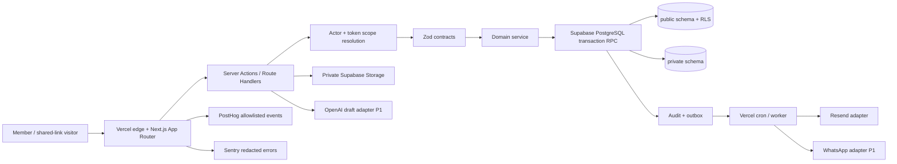
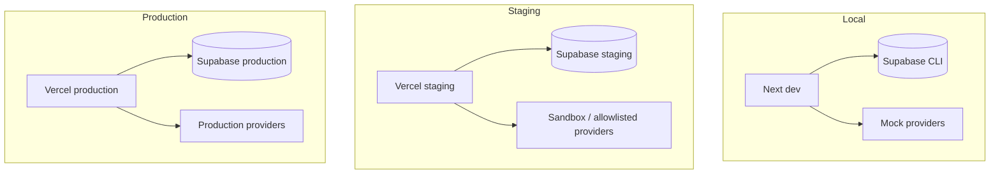
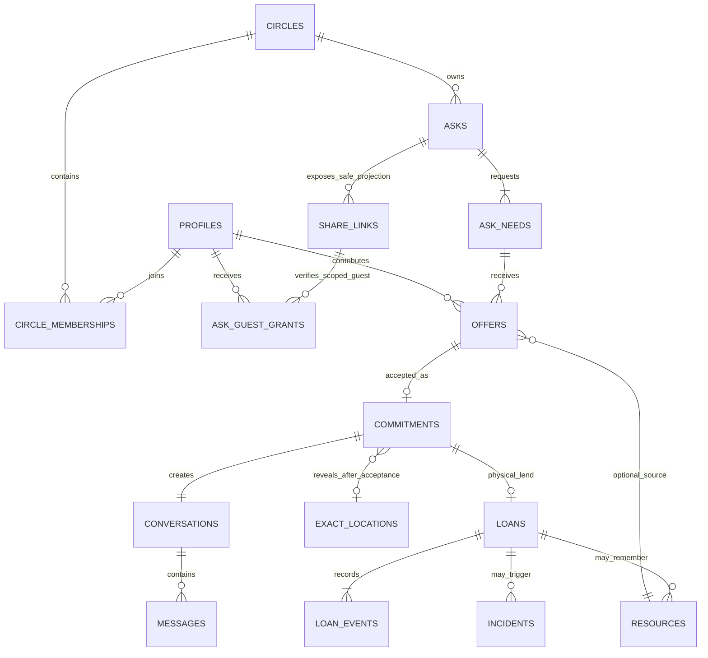

# Production Architecture Map

## Runtime



Core state remains in PostgreSQL. Provider metadata is never authoritative.

## Trust boundary

```text
Public browser:
  scoped share token, safe Ask projection, Offer draft

Authenticated member browser:
  RLS-safe member views; never service-role access

Next.js server:
  session/token validation, encryption/decryption, provider calls,
  service-role only for narrowly reviewed server-mediated operations

PostgreSQL public schema:
  RLS-protected domain data

PostgreSQL private schema:
  encrypted contact/location, token hashes, evidence metadata,
  outbox/jobs/audit/idempotency/webhook receipts/AI drafts

External providers:
  minimum destination/template/event data only
```

## Environment topology



There is no shared database, storage bucket, encryption key, signing secret, webhook secret, or unrestricted provider destination between staging and production.

## Database relationships



## Primary data ownership

| Record | Owner/control | Visibility |
|---|---|---|
| Ask | requester | Circle members; scoped public projection via token |
| Share link / guest grant | requester/system | server-only token resolution; one verified guest may be scoped to one Ask |
| Need | Ask owner | same as Ask projection, without private response data |
| Offer | contributor can withdraw; requester decides | contributor + requester only |
| Commitment | requester + contributor | accepted parties only |
| Exact location | location owner | accepted parties through server-mediated decrypt |
| Conversation/message | participants | participants; scoped moderator only with audited grant |
| Loan | lender + borrower | parties only |
| Loan event | append-only | parties and scoped support workflow |
| Resource hint | resource owner | owner/system private matching only by default |
| Incident/evidence | reporter/subject/scoped moderator | private and audited |

## Failure behavior

- Database failure: mutation fails; do not pretend success.
- Email/WhatsApp failure: domain write remains committed; outbox retries.
- Analytics/Sentry failure: never blocks user action.
- AI failure: manual form remains complete.
- Share-token failure/expiry: safe unavailable state; no Circle fallback.
- Worker replay: idempotency prevents duplicate messages/state.
